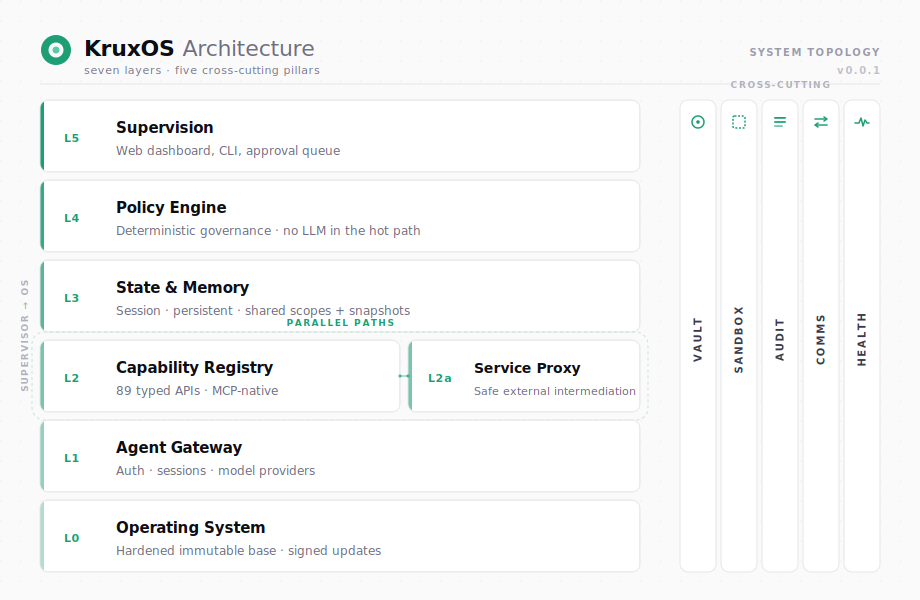
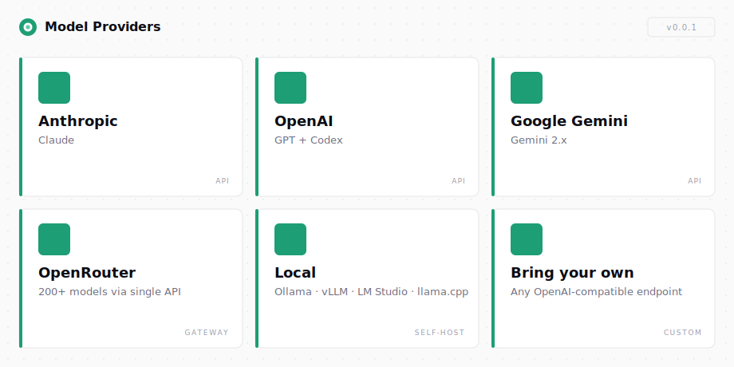

# KruxOS

> **The operating system for AI agents.**
> Agents run free. You stay in control.

KruxOS is a purpose-built operating system for AI agents — designed from the agent's perspective, not adapted from a human OS. No GUI overhead, no shell archaeology: every OS capability is exposed as a typed, documented API. Agents discover capabilities, invoke them through a structured pipeline, and see the system as a clean tool surface rather than a desktop they have to navigate.

Every call is mediated by a deterministic policy engine — no LLM in the hot path — and routed through the operator approval queue when policy says so. Humans interact through a web dashboard built for oversight and approval; agents interact through the typed tool surface. The result: faster, cheaper, more reliable agent runs — with full visibility and control.

## What's in this repo

This repository hosts:

- **Releases** — bootable VM images (`.vmdk` / `.qcow2` / `.img.gz` / `.box`), `SHA256SUMS`, and per-artefact cosign signatures, available from the [Releases page](../../releases).
- **Public docs** — getting-started, user guides, and capability reference under [`docs/public/`](docs/public/) (also at [docs.kruxos.com](https://docs.kruxos.com)).
- **Open extension surfaces** — `packs/`, `plugins/`, `themes/` host community contributions.

## Run KruxOS

1. Download the appropriate image from the [latest release](../../releases/latest):

   - `kruxos-x86_64.vmdk` — VirtualBox / VMware
   - `kruxos-x86_64.qcow2` — KVM / QEMU
   - `kruxos-x86_64.img.gz` — bare metal (decompress, write to USB / SSD)
   - `kruxos-x86_64.box` — Vagrant (libvirt provider)

   For aarch64 hosts, swap `x86_64` → `aarch64`.

2. (Optional) verify offline with cosign:

   ```bash
   cosign verify-blob \
     --bundle kruxos-x86_64.vmdk.cosign.bundle \
     --certificate-identity-regexp <id> \
     --certificate-oidc-issuer-regexp <issuer> \
     kruxos-x86_64.vmdk
   ```

3. Boot the VM. The console banner shows the dashboard URL — typically `https://<vm-ip>:7800`.

4. Open the dashboard and complete the first-boot wizard: vault passphrase → AdminAgent → license activation → User token → CLI install.

### Or via Docker

For quick local evaluation:

```bash
docker pull altvale/kruxos:latest

docker run -d --name kruxos --privileged \
  -e KRUXOS_VAULT_PASSPHRASE=<your-passphrase-12+chars> \
  -p 7800:7800 -p 7700:7700 -p 7701:7701 \
  altvale/kruxos:latest
```

Open `https://localhost:7800/wizard` (self-signed cert; accept the warning) and complete the same first-boot flow.

> **Docker limitation**: the Code Sessions feature (`/code` page) is not supported in the Docker image due to cgroup v2 delegation constraints. Use the VM image for code-session workloads. All other features — gateway, dashboard, agents, capabilities, vault, audit — work normally.

## Extend KruxOS

KruxOS surfaces three extension points for community contribution:

| Surface | Available | Notes |
|---|---|---|
| `packs/` — capability packs | v0.0.2 | pack-SDK CLI + remote registry land together |
| `plugins/` — extension plugins | v0.0.3 | plugin runtime ships v0.0.3 |
| `themes/` — dashboard themes | v0.0.3 | theme system ships v0.0.3 |

Each contribution declares its own license in its directory. Want to build one? Start at [`packs/`](packs/), [`plugins/`](plugins/), or [`themes/`](themes/) — or read [CONTRIBUTING.md](CONTRIBUTING.md) for the full flow.

## Architecture

<picture>
  <source media="(prefers-color-scheme: dark)" srcset="docs/assets/architecture-dark.svg">
  
</picture>

## Key Features

- **89 typed tools, built for agents.** Each capability ships with a declared schema — typed inputs, typed outputs, structured errors. Agents discover what's available and invoke through a contract instead of guessing shell syntax. Result: fewer tokens, fewer broken tool calls, more predictable execution. 13 categories: filesystem · process · network · git · scheduler · system · agent · state · comms · secrets · email · Slack · alerts.
- **Deterministic policy engine.** Four tiers (`autonomous` · `notify` · `approval_required` · `blocked`). No LLM in the policy path.
- **MCP-native gateway.** Claude Code + Codex connect directly. JSON-RPC fallback for everything else.
- **Per-agent sandbox.** User + network namespaces, cgroup v2 limits, seccomp BPF, nftables. Applied per-capability.
- **Use-not-read secrets vault.** AES-256-GCM. Capabilities consume secrets internally; raw values never exposed.
- **Hash-chained audit log.** Length-prefixed CBOR, tamper-evident, bounded ring-buffer with disk-full retry.
- **Multi-agent runtime.** Session isolation, topic-broker comms, shared state with optimistic locking, sub-15-second autonomous wake.
- **Per-principal soft-delete trash.** Destructive operations recoverable (168 h User · 24 h Agent · configurable). 30 s cancellation buffer on Slack writes.
- **External service integration.** Local read replicas, write buffering, batch protection. Gmail + Slack adapters in v0.0.1.
- **A/B partition updates.** Inactive-partition staging, reboot to apply, manual GRUB rollback.
- **Web dashboard.** Real-time supervision, approval queue, audit viewer, agent management, multi-model chat, code sessions.

## Model Providers

<picture>
  <source media="(prefers-color-scheme: dark)" srcset="docs/assets/model-providers-dark.svg">
  
</picture>

## Documentation

Full documentation: **[docs.kruxos.com](https://docs.kruxos.com)** — getting-started, user guides, CLI reference, capability docs, security whitepaper.

For this release: [v0.0.1 Release Notes](docs/release-notes/v0.0.1.md).

## Status

KruxOS v0.0.1 is **early beta** — single-node deployment, not for production use.

## License

KruxOS is a proprietary product. The appliance and all binary distribution artefacts on the [Releases](../../releases) page are governed by the [End User License Agreement](https://altvale.com/legal/kruxos-eula).

The open-source extension surfaces in `packs/`, `plugins/`, `themes/`, and the docs at `docs/public/` are licensed under [Apache 2.0](LICENSE) — see each subdirectory's `LICENSE` file. All other content in this repository (README, CONTRIBUTING, SECURITY, CODE_OF_CONDUCT, issue templates, `.well-known` metadata) is also licensed under Apache 2.0.

## Links

- **Website:** [kruxos.com](https://kruxos.com)
- **Docs:** [docs.kruxos.com](https://docs.kruxos.com)
- **Docker Hub:** [hub.docker.com/r/altvale/kruxos](https://hub.docker.com/r/altvale/kruxos)
- **Downloads:** [kruxos.com/downloads](https://kruxos.com/downloads)
- **Releases:** [Releases page](../../releases)
- **Issues:** [Issues page](../../issues)
- **Discord:** [discord.gg/VXvQKNv6Jn](https://discord.gg/VXvQKNv6Jn) — community support & discussion
- **Security:** [SECURITY.md](SECURITY.md) — disclosure process
- **Parent org:** [altvale.com](https://altvale.com)
