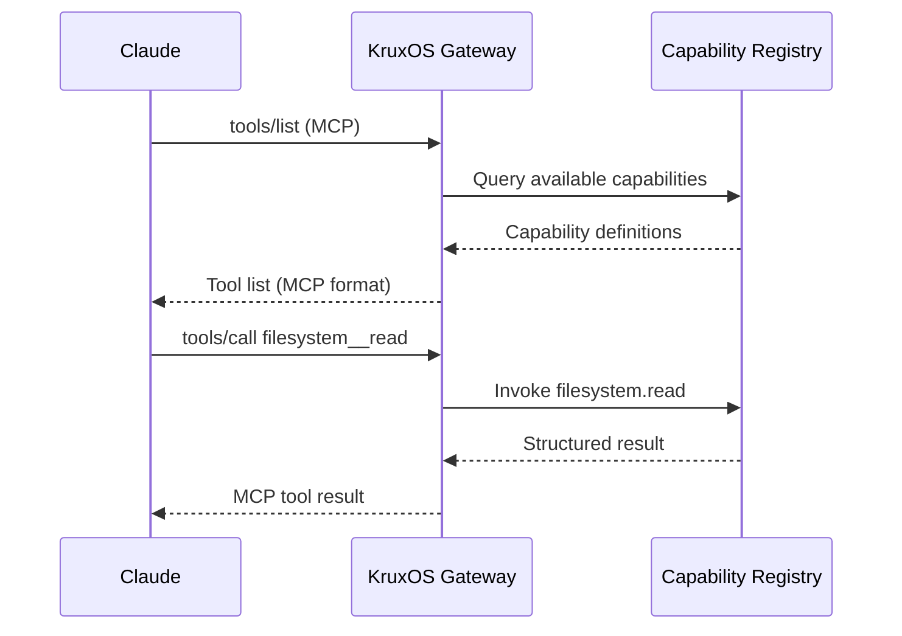

# Connect Claude

Claude speaks MCP natively — no adapter code needed. KruxOS is an MCP server.

## Option 1: Claude Code / Desktop via the seed-config generator (zero code)

On the appliance, render the Claude Code / Codex seed configs and write them straight into your home directory:

```bash
kruxos cli-config generate --write
```

The generator stores the raw agent token in the vault under `user/token/<label>` and emits a stanza that references the bundled `mcp-bridge` (stdio↔WebSocket). Tokens are never on argv — `mcp-bridge` self-rejects if its own argv contains a `krx_user_` substring.

For Claude Desktop specifically, drop the same MCP entry into `~/.config/claude/claude_desktop_config.json` (or the OS-specific path on macOS / Windows):

```json
{
  "mcpServers": {
    "kruxos": {
      "command": "/opt/kruxos/bin/mcp-bridge",
      "args": [],
      "env": {
        "KRUXOS_ENDPOINT": "wss://localhost:7700",
        "KRUXOS_AGENT_NAME": "default-agent",
        "KRUXOS_AGENT_TOKEN": "7f3a8c1d2e9b5a4f8e6c1d3b7a9f2e5c8d1b4a7f3c9e6d8b1a4c7f2e5d9b8a3c"
      }
    }
  }
}
```

Restart Claude Desktop. Claude now sees all KruxOS capabilities as tools. Capabilities at the `blocked` tier are omitted from `tools/list`; `approval_required` capabilities surface with their policy-tier annotation.

## Option 2: SDK (programmatic)

```python
from kruxos import KruxOS

async with KruxOS.connect_async() as agent:
    # Get MCP config for Claude
    config = agent.as_mcp_config()

    # Or use the SDK directly — Claude's tool calls
    # map 1:1 to capability invocations
    result = await agent.capabilities.invoke(
        "filesystem.read",
        path="/workspace/data.csv"
    )
```

## Option 3: Claude API with tool use

```python
import anthropic
from kruxos import KruxOS

client = anthropic.Anthropic()
agent = KruxOS.connect("localhost:7700", api_key="<64-char hex>")

# Convert capabilities to Claude tool format
tools = agent.capabilities.as_claude_tools()

response = client.messages.create(
    model="claude-sonnet-4-6",
    max_tokens=1024,
    tools=tools,
    messages=[{"role": "user", "content": "List files in /workspace"}]
)

# Handle tool calls
for block in response.content:
    if block.type == "tool_use":
        # Tool name: filesystem__read → filesystem.read
        capability = block.name.replace("__", ".")
        result = agent.capabilities.invoke(capability, **block.input)
```

## How it works



Claude sees each capability as a native MCP tool. The Gateway translates between MCP tool names (`filesystem__read`) and internal capability names (`filesystem.read`).

## Tool naming

MCP uses double underscores as separators:

| Capability | MCP tool name |
|------------|---------------|
| `filesystem.read` | `filesystem__read` |
| `git.commit` | `git__commit` |
| `email.send` | `email__send` |
| `state.persistent.get` | `state__persistent__get` |

## Verify connection

```bash
kruxos status
```

Expected output includes:

```
Active sessions: 1
  claude-agent  session sess-a1b2c3d4  connected 5m ago  12 invocations
```
