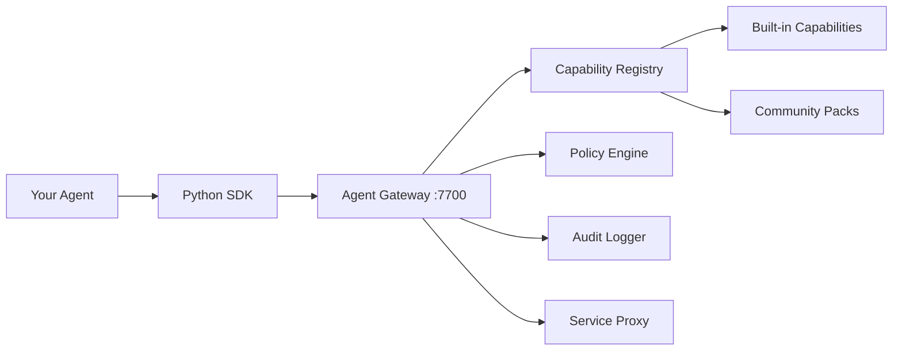

# Developer Documentation

Build agents, create capability packs, and integrate with the KruxOS platform.

## Getting started

-   **Python SDK Guide**

    ---

    Connect your agent to KruxOS, discover capabilities, invoke tools, and handle errors.

    [:octicons-arrow-right-24: SDK Guide](sdk-guide.md)

-   **Capability Reference**

    ---

    Complete reference for all 89 typed capabilities across 13 categories (filesystem, process, network, git, scheduler, system, agent, state, comms, secrets, email, Slack, alerts).

    [:octicons-arrow-right-24: Capabilities](capabilities/index.md)

-   **Pack Development**

    ---

    Create, test, and publish capability packs for the community.

    [:octicons-arrow-right-24: Pack Quickstart](packs/quickstart.md)

-   **API Reference**

    ---

    Gateway MCP/JSON-RPC protocol, supervision events, and dashboard REST API.

    [:octicons-arrow-right-24: API Docs](api/gateway-mcp.md)

## Architecture for developers

## Key concepts

| Concept | What it means for you |
|---------|----------------------|
| **Capabilities** | Typed APIs your agent invokes — structured inputs/outputs, no shell parsing |
| **Permission tiers** | Each capability has a tier: autonomous, notify, approval_required, or blocked |
| **Structured errors** | Every error includes a type, message, and recovery suggestions |
| **Packs** | Installable bundles of capability definitions + implementations |
| **Service Proxy** | Safe external service access (Gmail + Slack adapters in v0.0.1) with read-replica, write buffer, batch protection |
| **MCP** | Model Context Protocol — the Gateway's native surface; JSON-RPC is the documented fallback |

## Model connectors

KruxOS works with any LLM. Connector guides:

| Model | Protocol | Guide |
|-------|----------|-------|
| Claude (Anthropic) | MCP (native) | [Connect Claude](connectors/claude.md) |
| OpenAI (+ Codex / DeepSeek / Grok / Mistral / Groq / GLM via `base_url`) | Function calling adapter | [Connect OpenAI](connectors/openai.md) |
| Google Gemini | Function declaration adapter | [Connect Gemini](connectors/gemini.md) |
| Local (Ollama / vLLM / LM Studio / llama.cpp) | OpenAI-compatible adapter | [Connect Local](connectors/local.md) |

OpenRouter (200+ models) is also supported as a provider — configure it from the dashboard Settings page.

## Documentation map

| Section | Contents |
|---------|----------|
| [SDK Guide](sdk-guide.md) | Connection, discovery, invocation, errors, transactions, state |
| [Connectors](connectors/claude.md) | Model-specific integration guides |
| [Pack Development](packs/quickstart.md) | Create, test, document, and publish packs |
| [API Reference](api/gateway-mcp.md) | Protocol specs for MCP, JSON-RPC, WebSocket, REST |
| [Capability Reference](capabilities/index.md) | Auto-generated from YAML definitions |
| [Agent Experience](agent-experience.md) | Side-by-side: traditional Linux vs KruxOS |
| [Contributing](contributing.md) | How to contribute to KruxOS |
