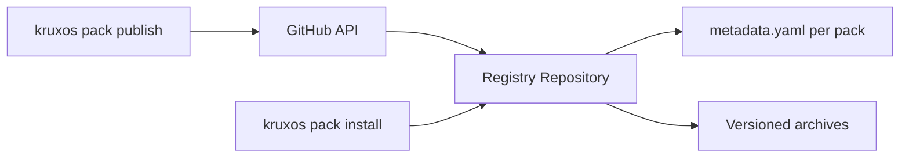

# Pack Registry

The KruxOS pack registry is the community hub for discovering and installing capability packs.

!!! warning "Registry ships in v0.0.2"
    v0.0.1 supports **local-path installs only** (`kruxos pack install ./path/to/pack`). The community registry, `kruxos pack search` / `kruxos pack info` discovery surfaces, GitHub-based publishing flow, seed packs, and the standalone `pack-sdk` CLI **all ship in v0.0.2**. The rest of this page describes the v0.0.2 surface.

## Browsing packs (v0.0.2)

### CLI

```bash
# Search for packs
kruxos pack search weather

# Show pack details
kruxos pack info my-weather-pack
```

Example output:

```
my-weather-pack v1.1.0
  by github-user · MIT license
  Weather data capabilities for KruxOS agents

  Capabilities:
    weather.current (autonomous) — Current weather for a location
    weather.forecast (autonomous) — Multi-day weather forecast

  Install: kruxos pack install my-weather-pack
```

### Web

Browse the registry at [packs.kruxos.com](https://packs.kruxos.com).

## Registry architecture (v0.0.2)

The registry that ships in v0.0.2 is a GitHub repository acting as a package index:



This approach was chosen for v0.0.2 because:

- No infrastructure to host or maintain
- Built-in authentication via GitHub
- Pull requests for community review
- Git history for auditability
- Free and open

A dedicated hosted registry is on the longer-term roadmap.

## OpenClaw compatibility

The KruxOS registry can index OpenClaw-compatible skills via the compatibility bridge:

```bash
# Install an OpenClaw skill through the bridge
kruxos pack install --openclaw skill-name
```

The bridge automatically:

1. Downloads the OpenClaw skill
2. Wraps it with type inference
3. Generates capability definitions
4. Installs it as a regular pack

See [Migration from OpenClaw](../../guides/migration-from-openclaw.md) for details.

## Pack security

### Verification

Every published pack includes a SHA-256 checksum. The CLI verifies integrity on install:

```bash
kruxos pack install my-weather-pack
```

```
Downloading my-weather-pack v1.1.0...
  ✓ Checksum verified (sha256:abc123...)
  ✓ Installed 2 capabilities
```

### Review process

Packs published to the community registry go through:

1. **Automated checks** — schema validation, no name conflicts
2. **Community review** — pull request on the registry repo
3. **Signature** — author identity verified via GitHub

### Secret safety

Pack implementations access secrets via the vault's use-not-read model. The secret value is injected into the execution environment — the pack code never sees the raw secret in a variable it could log or exfiltrate.

## Statistics

```bash
kruxos pack stats my-weather-pack
```

```
my-weather-pack
  Downloads: 1,247
  Versions: 3 (latest: 1.1.0)
  Stars: 42
  Last updated: 2026-03-20
```
