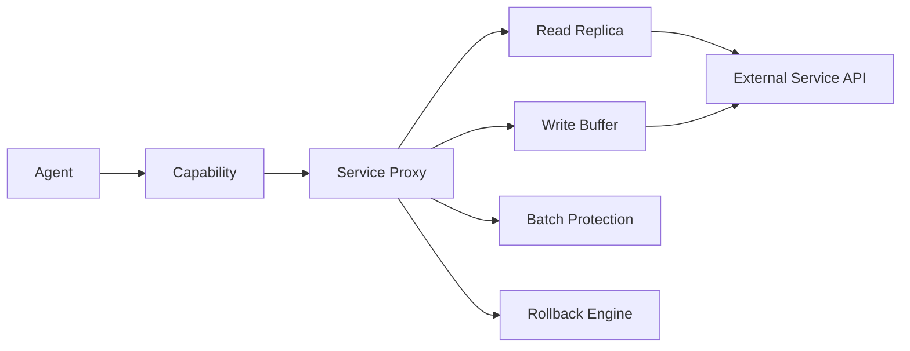

# Service Proxy Packs

Service Proxy packs connect external services (APIs, SaaS platforms) to KruxOS through the Service Proxy safety chain: read-replica, write buffer, batch protection, and rollback.

## Architecture



## Scaffold a proxy pack

```bash
kruxos pack init my-slack-pack --template service-proxy
cd my-slack-pack
```

This creates the standard pack structure plus proxy-specific files:

```
my-slack-pack/
├── pack.yaml
├── definitions/
│   └── slack.yaml           # Capability definitions
├── implementations/
│   ├── slack.py             # Capability implementations
│   └── proxy_adapter.py    # Service Proxy adapter
├── tests/
│   └── test_slack.py
└── README.md
```

## Implement the proxy adapter

The proxy adapter defines how to sync data, execute writes, and rollback:

```python
"""Slack Service Proxy adapter."""

from kruxos.packs.proxy import ProxyAdapter, SyncResult, WriteResult


class SlackAdapter(ProxyAdapter):
    """Adapter for Slack API via Service Proxy."""

    service_name = "slack"

    async def sync(self) -> SyncResult:
        """Sync channels and recent messages to local replica."""
        # Fetch from Slack API
        channels = await self.api_client.get("conversations.list")
        messages = []
        for channel in channels["channels"]:
            history = await self.api_client.get(
                "conversations.history",
                params={"channel": channel["id"], "limit": 100},
            )
            messages.extend(history["messages"])

        # Store in local replica
        await self.replica.upsert_many("channels", channels["channels"])
        await self.replica.upsert_many("messages", messages)

        return SyncResult(
            entries_synced=len(channels["channels"]) + len(messages),
            next_sync_in_seconds=120,
        )

    async def execute_write(self, operation: str, params: dict) -> WriteResult:
        """Execute a buffered write against the Slack API."""
        if operation == "slack.send_message":
            result = await self.api_client.post(
                "chat.postMessage",
                json={
                    "channel": params["channel"],
                    "text": params["text"],
                },
            )
            return WriteResult(
                success=True,
                external_id=result["ts"],
                rollback_data={"channel": params["channel"], "ts": result["ts"]},
            )

    async def rollback(self, operation: str, rollback_data: dict) -> bool:
        """Rollback a write operation."""
        if operation == "slack.send_message":
            await self.api_client.post(
                "chat.delete",
                json={
                    "channel": rollback_data["channel"],
                    "ts": rollback_data["ts"],
                },
            )
            return True
        return False
```

## Define capabilities with proxy annotations

```yaml
- name: slack.search_messages
  version: "1.0"
  purpose: "Searches Slack messages in the local replica."
  when_to_use: |
    Use slack.search_messages to find messages matching a query.
    Searches the local replica — no Slack API calls.
  inputs:
    - name: query
      type: String
      required: true
      description: "Search text."
    - name: channel
      type: String
      required: false
      description: "Filter to a specific channel."
  outputs:
    - name: messages
      type: Array
      description: "Matching messages."
  side_effects: []
  permission_tier: autonomous
  tags: ["slack", "read", "safe"]

- name: slack.send_message
  version: "1.0"
  purpose: "Sends a message to a Slack channel. Buffered for 2 minutes."
  when_to_use: |
    Use slack.send_message to post a message to a channel. The send
    is buffered for 2 minutes — it can be cancelled during that time.
  inputs:
    - name: channel
      type: String
      required: true
      description: "Channel name or ID."
    - name: text
      type: String
      required: true
      description: "Message text."
  outputs:
    - name: write_id
      type: String
      description: "Buffered write ID for cancellation."
    - name: buffer_until
      type: DateTime
      description: "When the message will be sent."
  side_effects:
    - description: "Buffered write — 2 minute delay."
      reversible: true
  permission_tier: notify
  tags: ["slack", "write", "buffered", "cancellable"]
```

## Configure proxy settings in pack.yaml

```yaml
name: my-slack-pack
version: "1.0.0"
description: "Slack integration for KruxOS"

proxy:
  adapter: implementations/proxy_adapter.py:SlackAdapter
  sync_interval_seconds: 120
  write_buffer_seconds: 120
  batch_limits:
    - operation: "slack.send_message"
      max_per_hour: 20
      escalate_to: approval_required
  rollback_enabled: true

secrets:
  - name: SLACK_BOT_TOKEN
    description: "Slack Bot User OAuth Token (xoxb-...)"
    required: true
  - name: SLACK_SIGNING_SECRET
    description: "Slack app signing secret"
    required: true
```

## Testing proxy packs

```python
from kruxos.packs.testing import ProxyTestHarness


@pytest.fixture
def harness():
    return ProxyTestHarness("my-slack-pack")


@pytest.mark.asyncio
async def test_sync(harness):
    """Test that sync populates the replica."""
    await harness.trigger_sync()
    result = await harness.invoke("slack.search_messages", query="hello")
    assert result.success


@pytest.mark.asyncio
async def test_send_is_buffered(harness):
    """Test that sends are buffered, not immediate."""
    result = await harness.invoke(
        "slack.send_message",
        channel="general",
        text="Hello!"
    )
    assert result.data["write_id"]  # Got a buffer ID
    assert not harness.api_calls  # No API call yet


@pytest.mark.asyncio
async def test_rollback(harness):
    """Test that sent messages can be rolled back."""
    result = await harness.invoke(
        "slack.send_message",
        channel="general",
        text="Oops"
    )
    await harness.flush_writes()  # Execute buffered write
    await harness.rollback(result.data["write_id"])
    # Message should be deleted
```

## Safety features inherited from the proxy

All Service Proxy packs automatically get:

| Feature | Description |
|---------|-------------|
| **Read replica** | Reads hit local SQLite, not the external API |
| **Write buffer** | Writes are delayed (configurable) and cancellable |
| **Batch protection** | Limits on operations per hour/session |
| **Rollback** | Undo recent writes if the adapter implements `rollback()` |
| **Dead letter queue** | Failed writes are retried with exponential backoff |
| **Disconnect** | Clean disconnect revokes tokens, stops sync, deletes replica |
