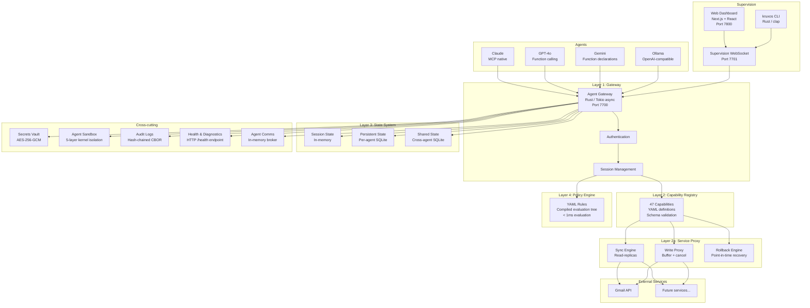
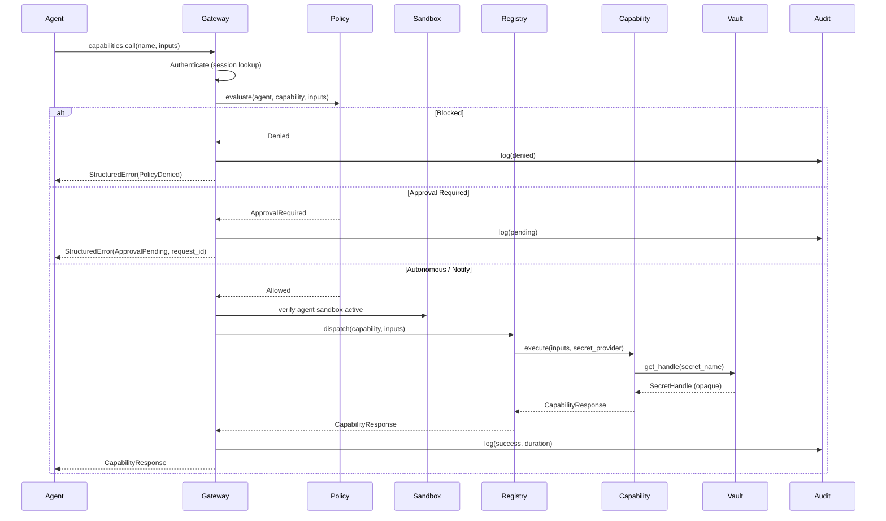

# Architecture

## System overview

KruxOS is a layered system where every agent interaction follows a deterministic pipeline:



## Request lifecycle

Every capability invocation follows this exact sequence:



## Technology stack

| Component | Technology | Rationale |
|-----------|-----------|-----------|
| Gateway | Rust (tokio async) | Performance-critical hot path, memory safety |
| Registry | Rust + YAML definitions | Definitions as data, hot-reload without recompile |
| Policy Engine | Rust | Deterministic evaluation, < 1ms per decision |
| Sandbox | Rust + Linux kernel | Direct kernel API for minimal overhead |
| Vault | Rust | Security-critical, minimal attack surface |
| Audit | Rust | Append-only writes, hash chain computation |
| State System | SQLite (WAL mode) | Single-node, crash-safe, zero config |
| Service Proxy | Rust framework + Python adapters | Framework in Rust for safety, adapters in Python for flexibility |
| Agent Comms | Rust + Protocol Buffers | Low-latency in-memory message broker |
| Dashboard | Next.js 15 + TypeScript + Tailwind | Modern web stack, real-time via WebSocket |
| Agent SDK | Python 3.11+ | Primary AI agent ecosystem language |
| CLI | Rust (clap) | Single binary, fast startup, shell completions |

## Data storage

All persistent data lives under `/data/kruxos/`:

| Database | Engine | Purpose | Scope |
|----------|--------|---------|-------|
| `agents.db` | SQLite | Agent identity, metadata | Global |
| `agents/{name}/state.db` | SQLite | Per-agent persistent state | Per-agent |
| `shared/state.db` | SQLite | Cross-agent shared state | Global |
| `approval_queue.db` | SQLite | Pending approval requests | Global |
| `vault.db` | SQLite | Encrypted secrets | Global |
| `audit/audit-index.db` | SQLite | Audit log query index | Global |
| `audit/audit-*.log` | CBOR files | Raw audit entries (hash-chained) | Daily files |
| `proxy/{service}/sync.db` | SQLite | Service read-replicas | Per-service |
| `proxy/{service}/write_buffer.db` | SQLite | Buffered outbound writes | Per-service |

All SQLite databases use WAL (Write-Ahead Logging) mode for concurrent read performance.

## Capability categories

| Category | Count | Examples |
|----------|-------|---------|
| `filesystem.*` | 10 | read, write, list, move, delete, search, stat, mkdir, copy, watch |
| `process.*` | 5 | run, list, kill, wait, info |
| `network.*` | 4 | http_request, dns_lookup, port_check, download |
| `git.*` | 7 | log, diff, status, commit, branch, checkout, clone |
| `scheduler.*` | 3 | cron_create, cron_list, cron_delete |
| `alerts.*` | 3 | send, list, acknowledge |
| `system.*` | 4 | metrics, health, info, shutdown |
| `agent.*` | 4 | session, capabilities, briefing, whoami |
| `secrets.*` | 3 | list, use, rotate |
| `comms.*` | 4 | send, receive, subscribe, publish |
| **Total** | **47** | |

Each capability is defined in YAML with: purpose, when_to_use, typed inputs/outputs, side effects, common patterns, and error types.

## Deployment topology

### Single-node (v0.0.x)

```
┌─────────────────────────────────┐
│         KruxOS Instance         │
│                                  │
│  Gateway ──── Registry           │
│     │                            │
│  Policy ──── Sandbox             │
│     │                            │
│  Vault ──── Audit ──── State     │
│     │                            │
│  Dashboard ──── Proxy            │
│                                  │
│  SQLite for all persistence      │
└─────────────────────────────────┘
```

The v0.0.x line is single-node with SQLite. All services run on one machine. This is the right architecture for personal use, small teams, and initial enterprise evaluation.

### Multi-node (future)

Multi-node clustering with PostgreSQL, distributed audit collection, and centralized policy management is planned for a later v0.0.x release and is available under enterprise contracts. Contact [sales@altvale.com](mailto:sales@altvale.com).

## Port map

| Port | Protocol | Service | Access |
|------|----------|---------|--------|
| 7700 | WebSocket (MCP + JSON-RPC) | Agent Gateway | Agent tokens (64-char hex) |
| 7701 | WebSocket | Supervision (live activity, audit events) | User tokens (`krx_user_*`) |
| 7702 | UDP | Loopback trigger-wake (`127.0.0.1`) | Loopback only |
| 7703 | HTTPS | User API (bearer-auth, loopback) | User tokens (`krx_user_*`) |
| 7800 | HTTPS | Web Dashboard | Operator session / User tokens |

The default appliance firewall accepts TCP 22 / 7700 / 7701 / 7702 / 7800.
