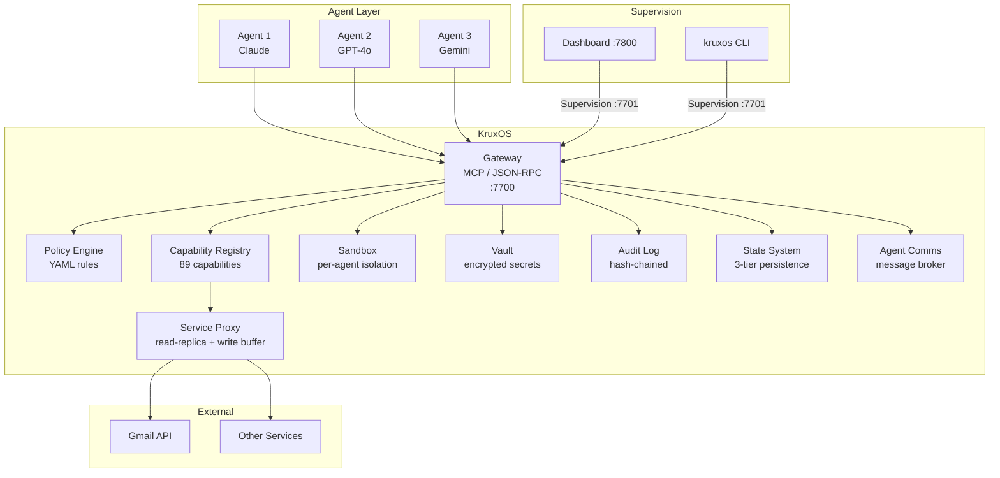

# Enterprise Overview

KruxOS provides the governance, security, and auditability that production AI agent deployments require.

## The challenge

Deploying AI agents in production creates unique risks:

- **Uncontrolled access** — agents with shell access can read any file, run any command, access any network service
- **No audit trail** — when something goes wrong, there's no record of what the agent did or why
- **No governance** — no way to enforce policies, require approvals, or rate-limit operations
- **Secret exposure** — API keys and credentials passed as environment variables are visible to agents
- **No isolation** — multiple agents share the same filesystem, processes, and network

## How KruxOS solves this

| Risk | KruxOS Solution | Implementation |
|------|-----------------|----------------|
| Uncontrolled access | Per-agent sandboxing | Linux namespaces + cgroup v2 + seccomp + nftables (Landlock MAC adds in v0.0.3) |
| No audit trail | Hash-chained audit logs | Append-only CBOR files with SHA-256 chain, SQLite index |
| No governance | Deterministic policy engine | YAML rules compiled to evaluation tree, 4 permission tiers |
| Secret exposure | Use-not-read vault | AES-256-GCM encrypted storage, agents never see raw values |
| No isolation | Per-agent resource limits | cgroup v2 CPU/memory/IO/PID limits per agent |

## Architecture

## Key differentiators

### Model-agnostic governance

KruxOS works with any AI model — Claude, GPT, Gemini, Llama, or any custom model. The governance layer is model-independent. Policies, sandboxing, and audit apply uniformly regardless of which model is driving the agent.

### Zero-trust architecture

Every agent operation goes through the same pipeline: **authenticate → evaluate policy → sandbox → execute → audit**. There are no backdoors, no admin-mode bypasses, and no way for an agent to skip the policy check.

### Deterministic policy evaluation

Policy decisions are **reproducible**. Given the same agent, capability, and parameters, the policy engine always returns the same result. No LLM is involved in governance decisions. Every decision can be explained, replayed, and audited.

### Production-ready safety

The Service Proxy prevents agents from causing damage to external services through:

- **Read-replicas** — read operations never touch the external service
- **Write buffers** — outbound operations are delayed, giving humans time to cancel
- **Batch protection** — bulk operations automatically escalate to human approval
- **Soft-delete** — destructive operations preserve originals for 24-hour recovery

## Documentation

| Page | What you'll learn |
|------|------------------|
| [Security Model](security-model.md) | Sandboxing, vault, audit chain, policy hierarchy |
| [Architecture](architecture.md) | System architecture with data flow diagrams |
| [Compliance](compliance.md) | SOC2, ISO27001 readiness |
| [Deployment Guide](deployment-guide.md) | Production deployment best practices |
| [Service Proxy](service-proxy.md) | External service safety model |
| [Pricing](pricing.md) | Personal (free), Commercial, and Enterprise tiers |
| [Contact](contact.md) | Talk to the KruxOS team |
