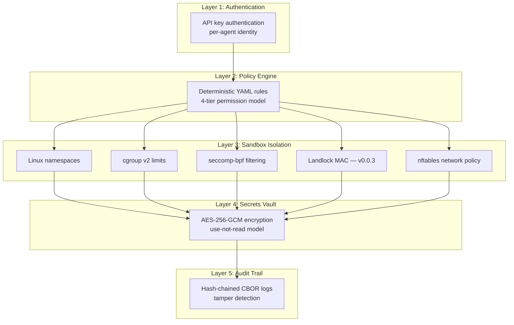

# Security Model

KruxOS implements defense-in-depth security with five independent layers. Each layer operates independently — compromising one does not compromise others.

## Security layers



---

## Agent sandboxing

Every agent runs inside a sandbox constructed from Linux kernel security mechanisms. **v0.0.1 activates namespaces, cgroup v2, seccomp-bpf, and nftables.** Landlock filesystem confinement, gateway/code-session privilege separation, and per-agent seccomp / resource policy YAML are part of the **v0.0.3 security architecture rework**.

Per-call fork model: capability handlers run in a forked child with the full sandbox applied; stateless capabilities (`system.time`, `system.info`, `system.health`, `agent.whoami`) execute in-process for low latency.

### Linux namespaces

Each agent gets isolated PID, mount, network, user, and UTS namespaces:

| Namespace | Isolation |
|-----------|-----------|
| **PID** | Agent sees only its own processes. Cannot signal or inspect host processes. |
| **Mount** | Agent sees only its workspace, shared read-only directories, and tmpfs. Root filesystem is not visible. |
| **Network** | Agent has its own network stack. Egress controlled by per-agent nftables rules. |
| **User** | Agent runs as an unprivileged user mapped to a non-root UID on the host. |
| **UTS** | Agent has its own hostname, preventing host identification. |

### cgroup v2 resource limits

Each agent is confined to a cgroup with hard resource limits:

| Resource | Default limit | Enforcement |
|----------|--------------|-------------|
| CPU | 50% of one core | `cpu.max` (50000/100000 us) |
| Memory | 512 MB hard limit | `memory.max`, swap disabled |
| I/O read | 50 MB/s | `io.max` rbps |
| I/O write | 25 MB/s | `io.max` wbps |
| Processes | 100 max | `pids.max` |
| tmpfs | 100 MB | Mount option |

These limits are **per-agent** — one agent consuming its full allocation does not affect other agents.

### seccomp-bpf syscall filtering

A BPF filter allowlists approximately 160 safe syscalls. Blocked syscalls include:

| Category | Blocked syscalls | Why |
|----------|-----------------|-----|
| Kernel modification | `mount`, `umount2`, `pivot_root` | Prevent filesystem escape |
| Process tracing | `ptrace` | Prevent debugging other processes |
| System control | `reboot`, `syslog`, `settimeofday` | Prevent host disruption |
| Module loading | `init_module`, `delete_module`, `kexec_load` | Prevent kernel modification |
| Advanced features | `bpf`, `perf_event_open`, `userfaultfd` | Prevent privilege escalation vectors |
| Namespace escape | `unshare`, `setns` | Prevent sandbox escape |

A **strict profile** additionally blocks `execve`, `execveat`, `fork`, and `vfork` for agents that should not spawn subprocesses.

### Landlock mandatory access control (v0.0.3)

!!! info "Landlock lands in v0.0.3"
    Landlock filesystem confinement is part of the **v0.0.3 security architecture rework**, which also includes gateway/code-session privilege separation and per-agent seccomp / resource policy YAML. v0.0.1 enforces filesystem boundaries through mount namespaces + per-agent host mounts under `/mnt/<label>` with path-escape detection in the gateway, plus seccomp blocking of the filesystem-escape syscalls (`mount`, `pivot_root`, `unshare`). The Landlock layer adds kernel-enforced MAC on top.

When v0.0.3 ships, Landlock will enforce these paths at the kernel level, irreversibly:

| Path | Access |
|------|--------|
| `/workspace` (agent-specific) | Read-write |
| `/shared` | Read-only |
| `/definitions` | Read-only |
| `/tmp` (tmpfs) | Read-write |

Landlock rules are **irreversible** — once applied to a process, they cannot be relaxed, even by root.

### Per-agent network policy

nftables rules control each agent's network egress:

- **Default-deny** — no outbound connections unless explicitly allowed
- **Per-agent allowlist** — specific domains/IPs configured in the agent's policy
- **Loopback always allowed** — agents can reach the Gateway (localhost:7700)
- **DNS allowed** — name resolution to configured DNS servers

---

## Secrets vault

### Use-not-read model

The vault's core security property: **agents can use secrets but never see them**.

When a capability needs a secret (e.g., an OAuth token for Gmail), the flow is:

1. Capability handler requests a `SecretHandle` from the vault
2. The handle is opaque — it has no `Serialize`, `Clone`, or `Display` trait
3. The handler calls `handle.resolve(capability_name)` to get the raw value
4. The vault verifies the capability is in the secret's allowed scope
5. The raw value is used for the API call and immediately dropped
6. The agent never sees any part of this process

### Encryption

| Property | Implementation |
|----------|---------------|
| Algorithm | AES-256-GCM (authenticated encryption with associated data) |
| Key derivation | Argon2id (64 MiB memory, 3 iterations, 4 parallelism) |
| Nonce | Random 96-bit per secret |
| Salt | Random 128-bit, stored in vault metadata |
| Master key | Derived from admin passphrase, held only in memory |
| Key zeroization | `zeroize` crate — master key is wiped from memory on drop |

### Secret scoping

Each secret is scoped to specific capabilities:

```yaml
# Example: Gmail OAuth token can only be used by email.* capabilities
secret: gmail_oauth_token
scope:
  - email.search
  - email.read
  - email.send
  - email.delete
```

If `filesystem.read` tries to access `gmail_oauth_token`, the vault returns an error — even though the request comes from the same Gateway process.

---

## Audit trail

### Hash chain integrity

Every audit entry is linked to the previous entry via SHA-256:

```
Entry N:
  hash = SHA-256(canonical_json(entry_fields) || hash_of_entry_N-1)
```

- **Genesis hash**: 64 zero bytes
- **Cross-file continuity**: The first entry of each daily log file chains from the last entry of the previous file
- **Tamper detection**: Modifying or deleting any entry breaks the chain from that point forward

### Verification

```bash
kruxos audit stats
```

```
Hash chain: verified ✓ (14,247 entries across 12 files)
```

If verification fails, the specific entry and file where the chain breaks is reported.

### Storage format

| Property | Implementation |
|----------|---------------|
| Format | CBOR (Concise Binary Object Representation) |
| File layout | Length-prefixed entries, one file per day |
| Index | SQLite with WAL mode for fast queries |
| Redaction | Secret fields auto-redacted before write |
| Retention | Configurable (default: 90 days) |

### What is logged

Every capability invocation is logged with:

- Timestamp (microsecond precision)
- Agent identity and session ID
- Capability name and full input parameters (with secrets redacted)
- Policy decision (tier, rule source)
- Outcome (success, error type, or approval status)
- Execution duration
- Hash chain link

### Disk-full resilience

If the disk fills up during an audit write:

1. The writer switches to an in-memory ring buffer (10,000 entries)
2. A critical health alert fires
3. Disk writes retry every 30 seconds
4. When space is available, the buffer is flushed
5. The system **never drops audit entries silently**

This behavior is configurable: set `audit.fail_mode: halt` to return errors instead of degrading.

---

## Policy engine

### Deterministic evaluation

The policy engine compiles YAML rules into an in-memory evaluation tree at startup. Evaluation is pure function of `(agent, capability, parameters)` — no external state, no randomness, no LLM.

Performance: <1 ms for 100+ rules, with O(1) lookup via category prefix indexing.

### Four permission tiers

| Tier | Behavior | Example |
|------|----------|---------|
| **Autonomous** | Execute immediately | `filesystem.read`, `filesystem.list` |
| **Notify** | Execute, notify supervisor | `filesystem.write` (small files) |
| **Approval Required** | Queue for human review | `process.run`, `filesystem.delete` |
| **Blocked** | Always denied | Operations that should never be agent-accessible |

### Policy hierarchy

```
System policies (immutable, shipped with KruxOS)
  └── Organization policies (admin-configured)
       └── Agent-specific policies (per-agent overrides)
```

**Critical invariant**: A lower layer can never be more permissive than a higher layer. If the system policy sets `secrets.read_raw` to `blocked`, no organization or agent policy can override that to `autonomous`.

### Rate limiting with escalation

Capabilities can have rate limits that escalate the permission tier when exceeded:

```yaml
email.send:
  tier: notify
  rate_limit:
    max: 10
    window: 3600
    on_exceed: approval_required
```

After 10 emails in an hour, subsequent sends require human approval until the window resets.

---

## Network security

### Port map

| Port | Service | Access control |
|------|---------|---------------|
| 7700 | Agent Gateway (WebSocket) | Agent API keys |
| 7701 | Supervision (WebSocket + HTTP) | Admin passphrase |
| 7702 | OpenClaw Bridge | Agent API keys (proxied to 7700) |
| 7800 | Web Dashboard (HTTPS) | Admin passphrase |

- Ports 7700 and 7702 accept only agent connections
- Port 7701 requires the admin passphrase — agents cannot connect
- Port 7800 serves HTTPS with an auto-generated self-signed certificate (Let's Encrypt optional)

### TLS

- Dashboard: HTTPS with auto-generated certificate on first run
- Gateway: WebSocket (ws://) by default, WSS optional via reverse proxy
- All internal communication is localhost-only

---

## Threat model summary

| Threat | Mitigation |
|--------|------------|
| Agent reads files outside workspace | Mount namespace + per-agent host-mount validation + seccomp (Landlock MAC adds kernel-level enforcement in v0.0.3) |
| Agent accesses other agent's data | Per-agent namespaces + cgroup isolation |
| Agent exfiltrates data via network | Default-deny nftables + per-agent egress policy |
| Agent accesses raw secrets | Use-not-read vault model + capability scoping |
| Agent escalates privileges | seccomp blocks privilege escalation syscalls |
| Agent exhausts system resources | Per-agent cgroup resource limits |
| Audit log tampered | SHA-256 hash chain with verification |
| Admin passphrase compromised | Argon2id KDF + vault re-key capability |
| Unauthorized policy relaxation | Hierarchy enforces most-restrictive-wins |
