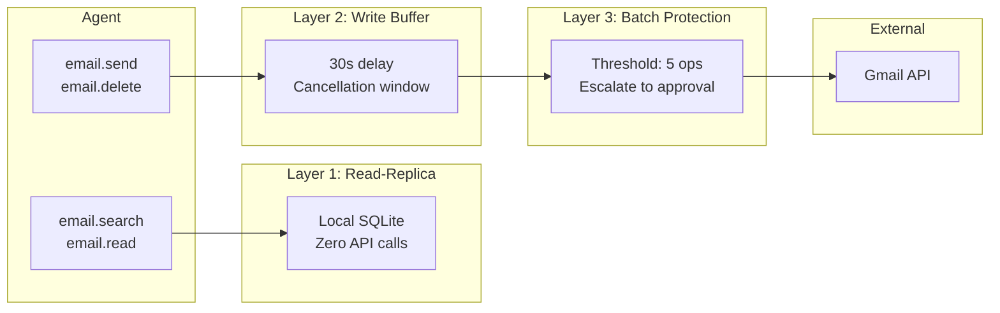

# Service Proxy

The Service Proxy is KruxOS's safety layer for external service integrations. It prevents agents from causing irreversible damage to connected services.

## The problem

When an AI agent has direct API access to Gmail, Slack, or any external service:

- A single bad prompt can send 1,000 emails
- A "clean up" instruction can delete years of messages
- There's no undo, no buffer, no human review window
- The damage is done before anyone notices

## The solution: three safety layers



### Layer 1: Read-replica

All read operations (search, list, read) query a **local SQLite database** — never the external service directly.

| Property | Detail |
|----------|--------|
| Sync frequency | Configurable (default: every 2 minutes) |
| Sync method | Incremental via service-specific APIs (e.g., Gmail History API) |
| Initial sync | Full metadata sync on service connection |
| Risk | **Zero** — no API call is made, no data is modified |

Benefits:

- Agents can search and read freely without any risk
- Reads are faster (local SQLite vs API call)
- No API quota consumption for read operations
- Agent cannot accidentally trigger rate limits on the external service

### Layer 2: Write buffer

All write operations (send, delete, move, label) are held in a **SQLite write buffer** before execution.

| Property | Detail |
|----------|--------|
| Default delay | 30 seconds |
| Cancellation | Agent or human can cancel during the delay |
| Visibility | Pending writes shown in dashboard and CLI |
| On flush | Write is executed against the external service |

During the buffer window:

- The agent receives a `buffer_id` and `cancel_deadline`
- The agent can cancel: `email.cancel(buffer_id="buf_abc123")`
- A human can cancel via the dashboard or CLI
- After the deadline, the write is executed

### Layer 3: Batch protection

If an agent attempts more operations than a threshold in a short window, the operation **automatically escalates to human approval**.

| Property | Detail |
|----------|--------|
| Default threshold | 5 operations per 10-minute window |
| Escalation | Changes tier from current to `approval_required` |
| Scope | Per-agent, per-service |
| Reset | Window resets after the time period |

This prevents runaway agents from sending bulk emails or deleting large numbers of messages.

## Rollback engine

For operations that are executed, the Service Proxy captures state before the write to enable **point-in-time rollback**:

| Operation | Rollback action |
|-----------|----------------|
| `email.delete` | Untrash (soft-delete for 24h) |
| `email.label` (add) | Remove the added label |
| `email.label` (remove) | Re-add the removed label |
| `email.send` | Cannot unsend (prevented by buffer) |

Rollback points are retained for 72 hours.

## Dead letter queue

If a write fails after the buffer flushes (e.g., network error, API error):

1. The failed operation enters the **dead letter queue**
2. Retries with exponential backoff (1min, 2min, 4min, 8min, 16min)
3. After max retries, a critical alert fires
4. The operation can be manually retried or discarded

## Connected services

### Gmail (v0.0.1 adapter)

Full integration with read-replica, write buffer, batch protection, and rollback. The 7 `email.*` capabilities are wired in v0.0.1; the dashboard / CLI connection UX lands in v0.0.2.

Capabilities: `email.search`, `email.read`, `email.send`, `email.reply`, `email.forward`, `email.delete`, `email.label`

### Future services

The Service Proxy is a framework. Adding a new service requires implementing three traits:

- `SyncAdapter` — how to sync data to the local replica
- `WriteExecutor` — how to execute writes against the service
- `RollbackCapable` — how to reverse operations

v0.0.1 ships Gmail and Slack adapters; Calendar, GitHub, and Jira are on the roadmap.

## Service lifecycle

### Connect (v0.0.2)

```bash
kruxos connect gmail --credentials /path/to/credentials.json
```

In v0.0.2 this will:

1. Start OAuth PKCE flow
2. Store the token in the vault (encrypted, with auto-refresh)
3. Run initial sync (full metadata download)
4. Enable `email.*` capabilities

!!! info "v0.0.1 state of the connect path"
    The Gmail / Slack adapters, vault token storage with auto-refresh, sync engine, write buffer, and batch protection are all wired in v0.0.1. What's missing is the operator-facing UX — the `kruxos connect <service>` CLI subcommand and the dashboard OAuth flow. Both land in **v0.0.2**. Until then, seed the vault entry manually (the adapter picks up tokens from `service/<adapter>/oauth` automatically).

### Monitor

```bash
kruxos status
```

Shows sync status, last sync time, pending writes, and any errors.

### Disconnect (v0.0.2)

```bash
kruxos disconnect gmail
```

In v0.0.2 this will:

1. Cancel all buffered writes
2. Revoke the OAuth token
3. Delete the local read-replica
4. Disable `email.*` capabilities

Disconnection is a first-class operation — it cleanly removes all traces of the service connection.
