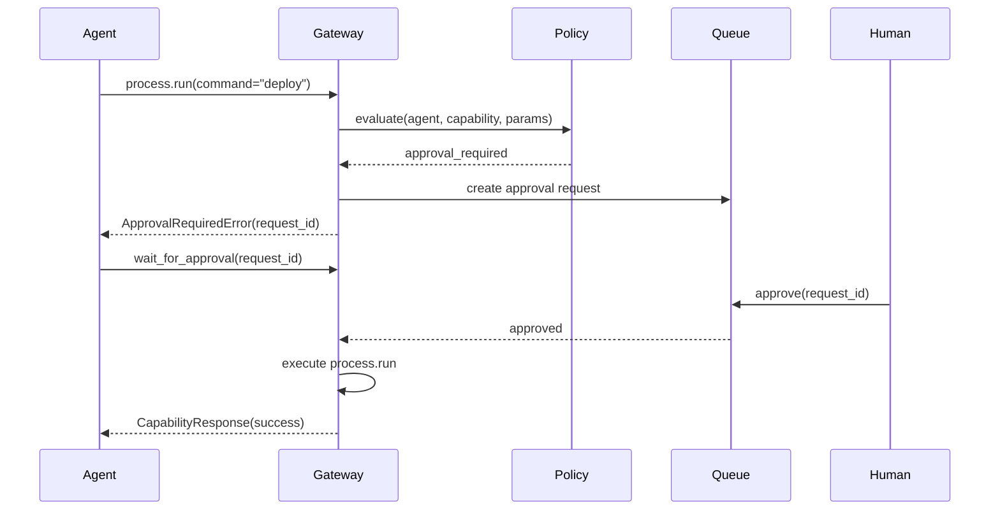

# Approval Workflow

By the end of this page, you'll understand how KruxOS handles operations that require human approval, and how to manage the approval queue.

## How it works

The policy engine classifies every capability invocation into one of four tiers:

| Tier | Behaviour | Example |
|------|-----------|---------|
| **Autonomous** | Executes immediately, no human involved | `filesystem.read`, `filesystem.list` |
| **Notify** | Executes immediately, supervisor notified | `filesystem.write` (small files) |
| **Approval Required** | Queued until a human approves or rejects | `process.run`, `filesystem.delete` |
| **Blocked** | Always denied, cannot be overridden | `secrets.read_raw` (does not exist) |

When an agent calls a capability that requires approval:



## For agents (SDK)

### Handling approval in code

```python
from kruxos import KruxOS
from kruxos.errors import ApprovalRequiredError

os = await KruxOS.connect_async(...)

try:
    # This may require approval depending on the policy
    result = await os.call_async(
        "process.run",
        command="systemctl",
        args=["restart", "myapp"],
    )
except ApprovalRequiredError as e:
    print(f"Waiting for approval: {e.request_id}")
    # Block until approved (or timeout)
    result = await os.wait_for_approval_async(
        e.request_id,
        timeout=300,  # 5 minutes
    )
    print(f"Approved! Result: {result.data}")
```

### Non-blocking approval

If you don't want the agent to block:

```python
try:
    result = await os.call_async("process.run", command="deploy.sh")
except ApprovalRequiredError as e:
    # Save the request ID and continue with other work
    await os.state.set_async("pending_deploy", {"request_id": e.request_id})
    # Check back later
```

## For supervisors (CLI)

### List pending approvals

```bash
kruxos approve list
```

Expected output:

```
ID       Agent       Capability        Parameters                    Requested
ap_001   my-agent    process.run       command=systemctl restart     2m ago
ap_002   deploy-bot  filesystem.delete path=/workspace/old-build/    5m ago
```

### Review details

```bash
kruxos approve show ap_001
```

Expected output:

```
Request:    ap_001
Agent:      my-agent
Capability: process.run
Parameters:
  command: systemctl
  args:    ["restart", "myapp"]
Requested:  2026-03-29 14:20:00
Policy:     team-moderate
Rule:       process.run → approval_required
Reason:     Service management commands require supervisor approval
```

### Approve

```bash
kruxos approve accept ap_001 --reason "Scheduled maintenance window"
```

### Reject

```bash
kruxos approve reject ap_002 --reason "Keep old builds until next week"
```

### Watch for new approvals

```bash
kruxos approve watch
```

Opens a live view showing new approval requests as they arrive. Press `a` to approve, `r` to reject the selected request.

## For supervisors (Dashboard)

Navigate to **Approvals** at `https://localhost:7800/approvals`.

### Tab strip and pending count

A five-tab strip at the top filters the queue: **Pending / Approved / Rejected / Timed out / All**. The Pending tab carries a count badge (also mirrored next to the page title) so you can see at a glance how many requests are waiting without scanning the list.

### Age-coloured status dots

Every row leads with a coloured status dot:

- Pending — **green** under 10 minutes, **amber** 10–30 minutes, **red** over 30 minutes
- Approved / Rejected / Timed out — status-coloured (green / red / grey)

### Click-to-expand row

Click a row to expand it in place. The expanded body lays out:

- A key-value grid: **Capability**, **Rule reference**, **Created**, **Last updated**
- **Agent reasoning** (free-text, may be empty)
- **Inputs** (the parameter JSON the agent sent)
- **Policy reason** (the rule that promoted the call to `approval_required`)

The capability name, principal badge (User / agent name), and a short reasoning preview stay visible on the row itself.

### Approve and reject

- **Approve** is a single inline button — one click decides the request.
- **Reject** opens a modal with an optional reason field. Press `⌘↵` (macOS) or `Ctrl+Enter` (Windows/Linux) to submit; press `Esc` or click the backdrop to cancel. If you leave the reason blank, the audit entry records the default `"Rejected by dashboard admin"`.

### Auto-refresh and the new-request toast

The page auto-refreshes every 5 seconds (a live dot in the header reads "Auto-refreshing every 5s"). When the pending count grows between polls, a toast slides in reading **"N new approval request(s) pending"** — you do not need to keep the tab visually focused to know that new work has arrived. The toast stack holds up to 3 notifications at once and each dismisses after 4 seconds.

There is no manual "Refresh now" button — the auto-refresh dot and the new-request toast cover the use case.

### Stale-recovery

If an approval was already decided in another tab (or timed out) before you clicked, the server returns HTTP 409 / 404 and the page refreshes the row to its current state. Your click is not retried against the stale state.

## Approval timeout

Approval requests do not expire by default. If the agent called `wait_for_approval_async` with a `timeout`, the agent will receive a `TimeoutError` after that duration — but the approval request remains in the queue. A supervisor can still approve it, and the agent can call `wait_for_approval_async` again with the same request ID.

## Configuring what needs approval

Approval tiers are defined in the policy YAML. See [Policies](policies.md) for how to write and manage policy rules.

Example policy rule:

```yaml
capabilities:
  process.run:
    tier: approval_required
    reason: "Process execution requires human review"
```

## Audit trail

Every approval decision (approve or reject) is logged to the audit system with:

- Who approved/rejected (admin identity)
- When the decision was made
- The reason provided
- The original request parameters

Query approval history:

```bash
kruxos audit query --capability process.run --outcome approved --last 7d
```

## Next steps

- [Policies](policies.md) — control which capabilities need approval
- [Monitoring](monitoring.md) — alert when approvals are waiting too long
- [Managing Agents](managing-agents.md) — agent lifecycle management
