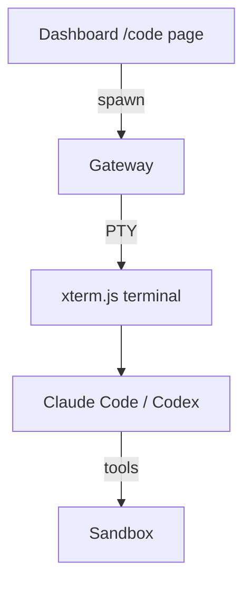

# Code Sessions

By the end of this page, you'll know how to run Claude Code and Codex CLI in browser-embedded terminals on your KruxOS appliance.

**Code Sessions** (`/code`) spawn full PTY terminals inside the gateway sandbox. You get the same CLIs as on the host, but running in an isolated environment you can monitor, kill, and audit from the dashboard.



## Requirements

- **VM image** (recommended) — Code Sessions need cgroup v2 delegation that the VM image provides natively.
- **Docker** — Code Sessions may not work reliably in Docker due to cgroup limitations. All other features work normally in Docker.

## Open a session

1. Navigate to **Code** in the dashboard sidebar.
2. Click **New session** and choose **Claude Code** or **Codex**.
3. A terminal panel opens with the CLI ready to use.
4. Type commands and interact as you would in a local terminal.

## Manage sessions

| Action | How |
|--------|-----|
| **List sessions** | The `/code` page shows all active sessions with CLI type, uptime, and memory usage |
| **Attach** | Click an existing session to reconnect to its terminal |
| **Kill** | Click **Kill** on a session card, or use `kruxos code kill <id>` |
| **List from CLI** | `kruxos code list` |

### Limits

| Limit | Default |
|-------|---------|
| Concurrent sessions | 4 |
| Memory per session | 2 GiB |
| Idle timeout | 4 hours |

## CLI management

```bash
# List active code sessions
kruxos code list

# Kill a session by ID
kruxos code kill <session-id>

# Attach to a session's output stream
kruxos code attach <session-id>
```

## How it differs from host CLI

| | Host CLI (Integrations) | Code Sessions (/code) |
|--|------------------------|----------------------|
| **Where it runs** | On the appliance host | Inside gateway sandbox |
| **Terminal** | Your local SSH/desktop | Browser xterm.js |
| **Isolation** | Host filesystem access | Sandboxed workspace |
| **Best for** | Daily development on the appliance | Demo, remote-only access, audited sessions |

Both routes tool calls through the same gateway and policy engine.

## Troubleshooting

| Symptom | Fix |
|---------|-----|
| /code page empty or errors | Confirm you're on the VM image, not Docker |
| Session won't start | Check concurrent session limit (kill idle sessions) |
| Terminal disconnects | Re-attach from the session list; idle sessions timeout after 4 hours |
| High memory warning | Kill sessions you're not using |

## Next steps

- [Host CLI Integrations](host-cli-integrations.md) — install CLIs on the host
- [Dashboard overview](../quickstart/dashboard.md) — all dashboard pages
- [Monitoring](monitoring.md) — watch resource usage