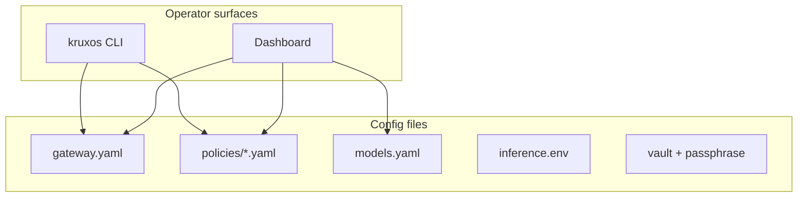

# Configuration Overview

By the end of this page, you'll know where KruxOS stores its configuration and which files you might need to edit.

Most configuration happens through the **dashboard** or **`kruxos` CLI** — you rarely need to edit files by hand. This guide maps what's where so you know where to look when something needs tuning.



## Main configuration files

| File | Purpose | How to edit |
|------|---------|-------------|
| `/etc/kruxos/gateway.yaml` | Gateway bind addresses, ports, feature flags | `kruxos config show/set` or dashboard Settings |
| `/data/kruxos/models.yaml` | Model provider definitions | **Settings → Models** |
| `/etc/kruxos/policies/system.yaml` | System-wide policy rules | **Policies** page or Identities (user policy) |
| `/data/kruxos/policies/agents/<name>.yaml` | Per-agent policy overrides | Agent detail → **Policy** tab |
| `/data/kruxos/inference.env` | Inference engine tuning | Copy from `/opt/kruxos/inference/inference.env.example` |
| `/data/kruxos/vault_passphrase_hash` | Vault encryption passphrase | Set once in wizard; not easily changed |

## Ports

| Port | Service | Bind |
|------|---------|------|
| 7700 | Agent Gateway (MCP / JSON-RPC) | All interfaces |
| 7702 | UDP trigger wake | Loopback |
| 7703 | User API (HTTP, bearer auth) | Loopback only |
| 7704 | Health endpoint | Loopback |
| 7800 | Dashboard (HTTPS) | All interfaces |

The User API and health endpoint are loopback-only by design. The dashboard reverse-proxies them for browser access.

## CLI config commands

```bash
# View a config value
kruxos config show server.bind_address

# Set a config value
kruxos config set server.bind_address 0.0.0.0

# View system status including config summary
kruxos status
```

## Policy files

Policies are YAML files that control which capabilities agents can use and at what tier. Three levels:

1. **System** — `/etc/kruxos/policies/system.yaml` — applies to all agents
2. **Per-agent** — `/data/kruxos/policies/agents/<name>.yaml` — overrides for one agent
3. **User** — managed via Identities page — gates host CLI tool calls

All policy files hot-reload — no gateway restart needed. See [Policies](policies.md) for syntax.

## Model providers

Stored in `/data/kruxos/models.yaml`. Managed entirely through **Settings → Models**:

- Add providers (Anthropic, OpenAI, Gemini, OpenRouter, Local, on-appliance inference)
- Set default models per role (chat, autonomous, fallback)
- Test connectivity

See [Model Providers](model-providers.md).

## Inference tuning

Optional overrides in `/data/kruxos/inference.env`:

```bash
cp /opt/kruxos/inference/inference.env.example /data/kruxos/inference.env
# Edit, then:
systemctl restart kruxos-inference
```

See [On-Appliance Inference](on-appliance-inference.md).

## Vault and secrets

- **Passphrase** — set during first-boot wizard; encrypts all vault contents
- **Secrets** — API keys, OAuth tokens, user tokens stored encrypted
- **Unlock** — dashboard login or `kruxos vault unlock`

```bash
kruxos vault status    # locked / unlocked
kruxos vault list      # secret names (not values)
```

## Environment variables (dashboard)

| Variable | Default | Purpose |
|----------|---------|---------|
| `PORT` | `7800` | Dashboard listen port |
| `KRUXOS_DATA_DIR` | `/data/kruxos` | Data directory |
| `KRUXOS_CONTROL_SOCKET` | `/run/kruxos/control.sock` | Supervision socket |
| `KRUXOS_HEALTH_URL` | `http://127.0.0.1:7704/health` | Health probe target |

## First-boot markers

| File | Meaning |
|------|---------|
| `/data/kruxos/wizard.done` | Wizard completed |
| `/data/kruxos/.configured` | Appliance configured |

## What not to edit by hand

- **Capability definitions** (`definitions/*.yaml`) — built into the image; extend via packs instead
- **Audit logs** — append-only, hash-chained
- **State databases** — managed by the state subsystem

## Next steps

- [Policies](policies.md) — write policy rules
- [Model Providers](model-providers.md) — configure AI backends
- [CLI Guide](../quickstart/cli.md) — `config`, `vault`, and more