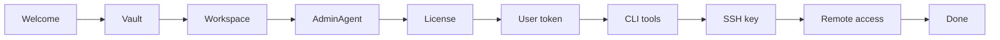

# First-Boot Wizard

By the end of this page, you'll know what the first-boot wizard sets up and how to walk through each step.

On a fresh KruxOS install, the dashboard opens into a guided wizard. It configures the four things every appliance needs: **secrets**, **identity**, **host CLIs**, and **policy**.

!!! note "No network yet?"
    The dashboard wizard runs in a browser, so the appliance has to be reachable before you can start it. On a machine whose only network is Wi-Fi, it isn't yet — join a network from the appliance's own console first. See [Joining Wi-Fi from the console](#joining-wi-fi-from-the-console). If you have an Ethernet cable plugged in, skip that section entirely.



## When the wizard appears

- First visit to `https://<appliance>:7800` after a fresh install
- After a factory reset (if `/data/kruxos/wizard.done` is removed)
- Re-run manually: `kruxos setup --reconfigure`

The progress rail at the top lets you click back to any completed step.

## Joining Wi-Fi from the console

Wireless is the one thing you can't set up from the dashboard on a fresh machine, because you need a network to reach the dashboard in the first place. So the join happens at the appliance's own console instead.

The console has its own text-mode setup wizard — separate from the browser wizard documented below, with its own step numbering — and **step 2 of 9, Network Configuration**, is where wireless is joined.

**On a wired appliance, skip this.** A first boot on Ethernet is unchanged: the Wi-Fi section reads `Wired connection active - Wi-Fi setup is optional.` and nothing on the screen waits for it. On hardware with no wireless adapter at all, the section isn't shown.

### Open the console wizard

At the appliance console — attached monitor and keyboard, or a serial console — log in as `root` with the passphrase you set at the very first boot prompt, then run:

```bash
kruxos setup
```

Step 2 shows the address the appliance currently has (or `unknown` if it has none), and under it a **Wi-Fi** section with **Scan** and **Hidden network** buttons. If you've already completed setup, use `kruxos setup --reconfigure` to get back to this screen.

### Scan and pick a network

1. Choose **Scan**. It takes a few seconds — the status line reads `Scanning...`, then `N network(s) found. Select one to join.`
2. Each network in range is listed with a four-step signal meter and its name:

    ```
    [***.] HomeNet
    [**..] HomeNet-Guest (open)
    [*...] CorpNet (not supported)
    [****] Studio-5G (saved)
    ```

    `(open)` means no password. `(saved)` means the appliance already has this network's password stored. `(not supported)` marks networks this release can't join — see [What this release does not do](#what-this-release-does-not-do).

3. Select the network you want. If it needs a password the status line changes to `Password for <network>:` and the cursor lands in the masked **Password** field. A saved or open network needs nothing typed — it starts joining immediately.
4. Type the password and choose **Join**. The status reads `Joining <network>...`, then `Connected to <network>`, and the address panel above refreshes with the address the network handed out.

A Wi-Fi password is 8 to 63 characters, or a 64-character hex key if you'd rather paste the pre-shared key directly. Leading and trailing spaces are kept rather than trimmed — they're legal in a Wi-Fi password, and silently dropping them would turn a correct password into a failed join.

### Networks that don't appear in the scan

Choose **Hidden network** and type the details in yourself. Two fields appear:

| Field | What to enter |
|-------|---------------|
| **Network name** | The exact name, case-sensitive — nothing is guessed for you |
| **Password** | The password, or leave it empty if the network is open |

Then choose **Join**. Use this path for a network that doesn't broadcast its name, and also for the rare network that your phone can see but the appliance's list doesn't show.

### If the password is wrong

The join comes back as `Could not join <network>. Check the password and try again.` The password field empties and takes the cursor, so you can retype and choose **Join** again straight away — as many times as you need.

There's nothing to clean up between attempts. A failed join isn't saved, so a typo can't leave a bad network behind for the appliance to keep retrying on later boots. A failure for some other reason — out of range, network gone — says so instead of blaming the password.

### Wi-Fi never blocks setup

The Wi-Fi section is optional in every case. **Accept & Continue** does not check it, so you can move on to the next console step with Wi-Fi joined, half-attempted, or untouched. **Configure Manually** on the same screen is for setting a static IP and is independent of Wi-Fi.

### Later boots

A network you've joined is saved on the appliance's data partition and rejoined automatically on every later boot — including after a KruxOS update, which replaces the system software but never touches that partition. You don't repeat this.

If the appliance has both a cable and Wi-Fi up, the wired connection is preferred.

### After first boot, use the dashboard

The console flow exists to get you online in the first place. Once you can reach the dashboard, wireless lives on the **Network** page: adapter and connection status, scan, join, join by name, disconnect, and forget a saved network. It's the same stored configuration either way — a network joined at the console is managed from the dashboard, and vice versa.

### Disk encryption and unlocking remotely

Saved Wi-Fi passwords live on the appliance's data partition, and if you encrypt that partition they can't be read until it's unlocked. Wireless therefore isn't up yet at the moment the appliance asks for the unlock passphrase after a reboot. The consequence is worth planning around:

- **Unlocking an encrypted appliance over the network requires a wired Ethernet connection.**
- On a Wi-Fi-only machine with the data partition encrypted, you unlock it at the console.

So if you want encryption at rest *and* you want to bring the appliance back up after a reboot without walking over to it, give it a cable. Appliances without disk encryption, and appliances you're happy to unlock at the console, are unaffected.

### What this release does not do

| Not in this release | What to do instead |
|---------------------|--------------------|
| **Enterprise (802.1X) networks** — WPA2/WPA3-Enterprise networks are listed as `(not supported)` and cannot be selected | Use a WPA2/WPA3-Personal network, a phone hotspot, or a cable. Enterprise support is planned for a later release. |
| **Networks with a sign-in page** — hotel, café and campus networks that require you to accept terms on a web page can't be completed on the appliance, which has no browser | Get through setup on a phone hotspot, your home or office network, or a cable |
| **Legacy WEP networks** — listed as `(not supported)` | Use a WPA2/WPA3-Personal network |
| **A country or region prompt** — there isn't one | Nothing to set, and nothing you need to look up before scanning |

## Step-by-step

### 1. Welcome

Orientation card explaining what the wizard configures. Click **Get started**.

### 2. Vault passphrase

Set the passphrase that encrypts secrets in the vault. A live strength meter scores your choice before you submit. **Choose a strong passphrase** — there is no recovery if you forget it.

### 3. Workspace

Pick the AdminAgent's home directory. The default `/data/kruxos/users/admin` is auto-created. Use the **directory browser** to click through folders, or toggle **Type path instead** for a free-text input.

### 4. AdminAgent (Identity)

Name your first agent and optionally configure a model provider:

| Provider | What you enter |
|----------|----------------|
| Anthropic | API key |
| OpenAI | API key (or base URL for compatible providers) |
| OpenAI Codex | OAuth device-code flow |
| OpenRouter | API key |
| Local | Endpoint preset |
| Skip | Defer to Settings later |

Credentials and the agent record are saved atomically.

### 5. License

Paste a JWT license key or skip. KruxOS is free for personal use.

### 6. User token

Generates a `krx_user_*` bearer token shown **once**. Copy it — you'll need it for host CLIs and the User API. Acknowledge with the checkbox to continue.

### 7. Install CLI Tools

Optional. Installs Claude Code and/or Codex CLI with seed configs. Both can be installed later from **Integrations**.

### 8. SSH key (optional)

Paste an SSH public key if you plan to use [SSH access](ssh-access.md) later. You can skip and add keys from **Settings → System**.

### 9. Remote access (optional)

Optional Tailscale setup. Enable remote dashboard access from your tailnet. See [Remote Access](remote-access.md#built-in-tailscale-recommended) for details. Skip if you'll configure this later.

### 10. Done

Confirmation screen with a link to the main dashboard. Your appliance is ready.

## After the wizard

| What was created | Where to manage it later |
|------------------|-------------------------|
| Wi-Fi network | **Network** page |
| Vault passphrase | Cannot be changed easily — plan ahead |
| AdminAgent | **Agents** page |
| User token | **Identities** page |
| Model provider | **Settings → Models** |
| CLI seed configs | **Integrations** page |
| SSH key | **Settings → System** |
| Tailscale | **Settings → System → Remote access** |

## Re-run the wizard

```bash
kruxos setup --reconfigure
```

Or use the dashboard if a reconfigure entry point is available. Re-running does not destroy existing agents or data — it walks through configuration again.

## Troubleshooting

| Symptom | Fix |
|---------|-----|
| Nothing to browse to — the appliance has no network | Wi-Fi-only machine: join a network at the console first ([above](#joining-wi-fi-from-the-console)). Otherwise check the cable and the address on the console banner. |
| Wi-Fi section missing from console step 2 | The appliance reports no wireless adapter — the section is hidden rather than shown broken. Use Ethernet on this machine. |
| Wi-Fi status says the service isn't responding yet | Wireless is still starting. Choose **Scan** again after a moment. |
| Wizard loops back to step 1 | Check `/data/kruxos/wizard.done` exists after completion |
| Provider registration fails | Verify API key; agent is not created if provider fails |
| Lost User token | Create a new one on **Identities** — the wizard token still works if you saved it |
| Gmail OAuth fails during wizard | Gmail connect is not part of the wizard — use [Connecting Services](connecting-services.md) after |

## Next steps

- [Getting Started](../getting-started.md) — connect your first AI model
- [Web Dashboard](../quickstart/dashboard.md) — tour every page
- [Host CLI Integrations](host-cli-integrations.md) — wire up Claude Code or Codex