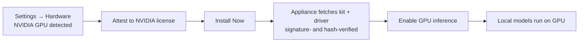

# GPU Drivers

By the end of this page, you'll know how to install an NVIDIA driver on your KruxOS appliance and turn on GPU-accelerated local inference.

KruxOS can run local inference on an NVIDIA GPU. NVIDIA's driver is proprietary and licensed, so **KruxOS never hosts or redistributes it** — it always comes straight from NVIDIA. What changed in this release is convenience: after you attest to NVIDIA's license, the appliance can fetch the exact version-pinned driver **directly from NVIDIA's own servers** for you, so a typical install is one click. The manual download-and-upload path is still there whenever you want it — and it's the air-gapped install story.

## What you need

- A supported NVIDIA GPU (the proven reference is an RTX 30-series / Ampere card; others using the open kernel modules work too).
- An **x86_64** KruxOS appliance. GPU acceleration is x86_64-only in this release; on other architectures the GPU is shown as detected but not installable.
- For the one-click path: an appliance image that carries a trusted, version-pinned NVIDIA download URL (current images do). If yours doesn't, KruxOS tells you and you use the manual path below — nothing else changes.

Two components go into a working driver:

1. The **KruxOS GPU kit** for this image — the open kernel module plus the compute backend. This is redistributable, so **KruxOS hosts it** as a GitHub Release asset and can fetch it for you; it is Ed25519 **signature-verified** on the appliance before anything is staged.
2. The **NVIDIA driver `.run`** for the exact version this image expects. This is NVIDIA's proprietary driver — **KruxOS never hosts or proxies it.** In the one-click path the appliance downloads it directly from NVIDIA after your attestation; otherwise you download it from NVIDIA yourself and upload it.

## Install a driver (one-click)

1. Open **Settings → Hardware**. A detected NVIDIA GPU appears as a card at the top showing **"Driver not installed."**
2. Click **Install driver**. When both components can be fetched automatically, the dialog shows a **One-click install** summary: the KruxOS GPU kit (fetched from the official release and signature-verified) and the exact **NVIDIA driver version** (fetched directly from NVIDIA after your attestation and checked against the kit's signed checksum).
3. Read the **NVIDIA license attestation** and tick the box confirming you accept NVIDIA's license. The dialog links the version-pinned NVIDIA Driver License Agreement. Your acknowledgement is recorded **locally** for your own audit trail and is never sent anywhere.
4. Click **Install Now**. KruxOS runs the install as a sequence of visible steps:
   - **Fetching kit** and **Verifying kit signature** — download the GPU kit and check its Ed25519 signature.
   - **Fetching NVIDIA driver** — download the `.run` straight from NVIDIA, with a byte-progress bar (this step runs strictly *after* your attestation).
   - **Extracting driver** and **Staging files** — unpack the userspace + GSP firmware.
   - **Checking versions** — confirm the driver, kernel module, and compute backend all match this image.
   - **Finalising** — write the manifest and load the driver.

   If any check fails, the install stops cleanly and tells you what to do — nothing is left half-installed.

!!! info "The driver download is hash-checked"
    The appliance verifies the driver it fetches from NVIDIA against a checksum **signed into the GPU kit**. On the one-click path a mismatch **blocks** the install (KruxOS refuses to extract an unexpected driver). If the kit for your image carries no such signed checksum, KruxOS will **not** auto-fetch the driver at all — it asks you to download the `.run` from NVIDIA and upload it manually instead.

## Manual / air-gapped install

The two-upload flow is always available — pick **Advanced / manual options** in the install dialog. It's also the **air-gapped** path: no install-time network is needed, because you bring both files yourself.

1. In the install dialog, open **Advanced / manual options**.
2. **KruxOS GPU kit** — either let the appliance fetch it automatically, or choose **Upload the kit manually instead (air-gapped)** and provide the `kruxos-gpu-kit-…tar.gz` for this image (the Hardware card links the exact GitHub-Release asset). You can optionally upload the kit's detached `.sig` alongside it; when present, the kit's signature is verified before anything is staged.
3. **NVIDIA driver** — choose **Upload the NVIDIA .run manually instead** and provide the exact `NVIDIA-Linux-x86_64-<version>.run`. Download it from NVIDIA's official host using the version-pinned link the card shows.
4. **Upload or link a path** for each file — uploads stream straight to disk, so multi-hundred-MB files are fine; or copy a file to `/data/kruxos/uploads/` (via the **Uploads** page, USB, or SCP) and paste its path.
5. Tick the **NVIDIA license attestation** box, then click **Install Now**.

!!! note "Manual uploads warn (not block) on a checksum mismatch"
    If you upload a `.run` that doesn't match the kit's signed checksum, KruxOS **warns** but proceeds — you're the operator and may legitimately hold a re-downloaded build of the same version. (An *auto-fetched* driver that mismatches is blocked instead.) The version check in **Checking versions** still runs either way: if the driver version doesn't match the kit / this image, the install stops and tells you which version to download.

!!! tip "No trusted NVIDIA URL on this image?"
    If the image carries no trusted, version-pinned NVIDIA URL, the one-click path isn't offered and an auto-fetch attempt reports that *no trusted NVIDIA download URL is available for this appliance — download the .run from NVIDIA and upload it manually.* The manual flow above is exactly that path.

## Turn GPU inference on

Once a driver is installed, click **Enable GPU inference** (on the Hardware card, or on **Settings → Inference**). KruxOS wires the local inference engine to the GPU and restarts it. You need a local model staged first (see [On-Appliance Inference](on-appliance-inference.md)). Click **Disable GPU inference** to go back to CPU.

## After a system update

A KruxOS update can change the kernel. If it does, your installed driver may no longer match — the appliance falls back to CPU automatically (it never gets stuck), and the Hardware page shows **"needs reinstall."** Just reinstall the matching driver from the Hardware page; the one-click path works here too.

## Uninstall

Click **Uninstall** on the Hardware card and type `uninstall` to confirm. This removes the driver and turns GPU inference off (the engine reverts to CPU).

## Frequently asked

| Question | Answer |
|----------|--------|
| Does KruxOS host or proxy NVIDIA's driver? | No. The proprietary `.run` always comes straight from NVIDIA — on the one-click path the appliance downloads it directly from NVIDIA's own servers; KruxOS never hosts, proxies, or redistributes it. (KruxOS *does* host the redistributable GPU kit.) |
| Does KruxOS send my driver or license acknowledgement anywhere? | No. The license acknowledgement is a local audit record only, and the driver is never uploaded off the appliance. |
| Can I still install fully offline? | Yes — use **Advanced / manual options** and upload both files. That path needs no install-time network. |
| How does the appliance know the driver is genuine? | The GPU kit is Ed25519-signature-verified, and the driver is hash-checked against a checksum signed into that kit (a mismatch blocks an auto-fetched driver). |
| Can I use the Uploads page for large model files too? | Yes — uploads stream to disk, so multi-GB model files work. |
| AMD / Intel GPUs? | Detected and shown as status only in this release; installable support is planned. |

## Next steps

- [On-Appliance Inference](on-appliance-inference.md) — pull and run local GGUF models
- [Model Providers](model-providers.md) — connect cloud providers alongside local inference
- [File Transfer](file-transfer.md) — get large files onto the appliance
