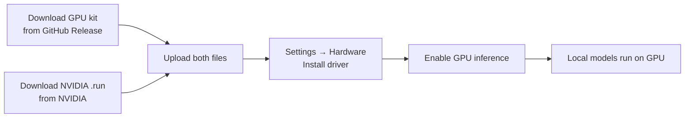

# GPU Drivers

By the end of this page, you'll know how to install an NVIDIA driver on your KruxOS appliance and turn on GPU-accelerated local inference.

KruxOS can run local inference on an NVIDIA GPU. Because NVIDIA's driver is proprietary and licensed, **KruxOS never downloads or bundles it** — you provide the driver, KruxOS does the rest. This keeps the license relationship between you and NVIDIA, and keeps the appliance air-gap-friendly.

## What you need

- A supported NVIDIA GPU (the proven reference is an RTX 30-series / Ampere card; others using the open kernel modules work too).
- An **x86_64** KruxOS appliance. GPU acceleration is x86_64-only in this release; on other architectures the GPU is shown as detected but not installable.
- **Two downloads** the **Hardware** page links for you: (1) the **KruxOS GPU kit** for this image (a GitHub Release asset — KruxOS hosts this, it's redistributable); (2) the **NVIDIA driver `.run`** for the version this image expects (from NVIDIA — KruxOS never hosts it).

## Install a driver

1. Open **Settings → Hardware**. Your hardware is listed; a detected NVIDIA GPU appears as a card at the top with **"Driver not installed."**
2. The card shows **what to download**: the **KruxOS GPU kit** (with a direct GitHub-Release link) and the **exact NVIDIA driver version** — for example `NVIDIA-Linux-x86_64-580.82.09.run`.
3. Click **Install driver**. In the dialog:
   - **Download (1)** the **KruxOS GPU kit** from the GitHub-Release link shown (it bundles the open kernel module + the compute backend).
   - **Download (2)** the exact NVIDIA `.run` from the **direct, version-pinned link the page shows** — `NVIDIA-Linux-x86_64-<version>.run`, served from NVIDIA's official download host.
   - **Upload both** (each streams straight to disk, so multi-hundred-MB files are fine) — or **link a path** for either (copy to `/data/kruxos/uploads/` via the **Uploads** page, USB, or SCP, and paste the path).
   - Tick the box confirming you obtained the NVIDIA driver from NVIDIA and accepted their license. This is recorded **locally** for your own audit trail and is never sent anywhere.
4. Click **Install driver**. KruxOS stages the kit + extracts the driver (userspace + GSP firmware), **checks that all the versions match**, and finalises the install. If the driver version doesn't match the kit / this image, the install stops and tells you which version to download instead — nothing is half-installed.

!!! tip "Air-gapped installs"
    The manual download-and-upload path is also the **air-gapped** install story (no install-time network needed).

## Turn GPU inference on

Once a driver is installed, click **Enable GPU inference** (on the Hardware card, or on **Settings → Inference**). KruxOS wires the local inference engine to the GPU and restarts it. You need a local model staged first (see [On-Appliance Inference](on-appliance-inference.md)). Click **Disable GPU inference** to go back to CPU.

## After a system update

A KruxOS update can change the kernel. If it does, your installed driver may no longer match — the appliance falls back to CPU automatically (it never gets stuck), and the Hardware page shows **"needs reinstall."** Just reinstall the matching driver from the Hardware page.

## Uninstall

Click **Uninstall** on the Hardware card and type `uninstall` to confirm. This removes the driver and turns GPU inference off (the engine reverts to CPU).

## Frequently asked

| Question | Answer |
|----------|--------|
| Does KruxOS send my driver or license anywhere? | No. KruxOS never hosts NVIDIA's driver and never phones home; the license acknowledgement is a local record only. |
| Can I use the Uploads page for large model files too? | Yes — uploads stream to disk, so multi-GB model files work. |
| AMD / Intel GPUs? | Detected and shown as status only in this release; installable support is planned. |

## Next steps

- [On-Appliance Inference](on-appliance-inference.md) — pull and run local GGUF models
- [Model Providers](model-providers.md) — connect cloud providers alongside local inference
- [File Transfer](file-transfer.md) — get large files onto the appliance