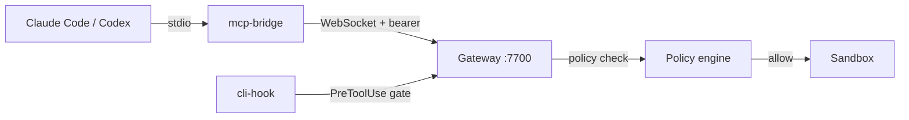

# Host CLI Integrations

By the end of this page, you'll know how to install and configure Claude Code and Codex CLI on your KruxOS appliance so every tool call goes through the sandbox and policy engine.

Host CLIs are the AI assistants that run on the appliance itself (or your laptop connected to it). KruxOS doesn't replace them — it **governs** them. When Claude Code wants to read a file or run a command, the request routes through the gateway, gets policy-checked, and runs in the sandbox.



## Prerequisites

- First-boot wizard completed (vault unlocked, User token created).
- A `krx_user_*` bearer token — from the wizard or [Identities](user-identities.md).

## Install from the dashboard

1. Open **Integrations** in the sidebar.
2. Each card (**Claude Code**, **Codex CLI**) shows a status badge:
   - **Not installed** — click **Install**
   - **Installed (vN.N.N)** — already wired up
   - **Vault locked** — unlock the vault first
3. **Install** runs `npm install -g` for the CLI and writes the seed config in one step. Expect 1–5 minutes.
4. **View config** shows the generated seed file with a copy button.
5. **Regenerate** overwrites the seed config (confirms before writing).

## Install from the CLI

```bash
# Generate and write seed configs for both CLIs
kruxos cli-config generate --write

# Install CLIs manually if needed
npm install -g @anthropic-ai/claude-code
npm install -g @openai/codex
```

## Claude Code

After install, `~/.claude/settings.json` points at the bundled `mcp-bridge`:

```json
{
  "mcpServers": {
    "kruxos-gateway": {
      "command": "/opt/kruxos/bin/mcp-bridge",
      "args": ["--cli=claude-code", "--label", "claude-code", "--gateway", "ws://127.0.0.1:7700/"]
    }
  }
}
```

The bearer token is resolved from the vault by label — not stored in the file.

Launch Claude Code in any project directory:

```bash
claude
```

Ask: *"What KruxOS tools do you have?"* — it should list capabilities visible to your policy tier.

!!! tip "Non-interactive shells"
    For CI or SSH sessions where the vault isn't reachable, set `KRUXOS_USER_TOKEN=krx_user_…` in the environment. Never pass the token on the command line.

## Codex CLI

Codex gets three config files:

| File | Purpose |
|------|---------|
| `~/.codex/config.toml` | MCP server + model settings |
| `/etc/codex/requirements.toml` | Disables native shell — routes through KruxOS |
| `~/.codex/hooks/` | PreToolUse hooks via `cli-hook` |

After install, run `codex` and verify tool calls appear in the dashboard **Activity** feed.

See [OpenAI Codex CLI](codex.md) for Codex-specific details and policy examples.

## How governance works

1. **MCP bridge** — translates the CLI's tool calls to gateway WebSocket messages.
2. **cli-hook** — intercepts PreToolUse events (bash, edit, etc.) and asks the gateway for a policy decision before execution.
3. **Policy engine** — evaluates tier (autonomous / notify / approval_required / blocked).
4. **Sandbox** — allowed operations run in an isolated environment with resource limits.

Native shell tools in both CLIs are disabled at the config layer so nothing bypasses the gateway.

## Regenerate after token rotation

If you revoke and reissue your User token:

1. Open **Integrations** and click **Regenerate** on the affected CLI card.
2. Or run `kruxos cli-config generate --write`.
3. Restart the CLI.

## Troubleshooting

| Symptom | Fix |
|---------|-----|
| CLI shows no KruxOS tools | Check vault is unlocked; regenerate config; verify gateway is running (`kruxos status`) |
| Install fails (npm timeout) | Retry — install is idempotent; check network from appliance |
| Tool calls not in Activity feed | Confirm `mcp-bridge` path in seed config matches `/opt/kruxos/bin/mcp-bridge` |
| Permission denied on tool call | Check user policy on **Identities** and agent policy tier |

## Next steps

- [Connect Claude Code](../quickstart/claude-code.md) — MCP setup details
- [OpenAI Codex CLI](codex.md) — Codex-specific guide
- [First Conversation](first-conversation.md) — example prompts
- [Approval Workflow](approval-workflow.md) — how gated operations work