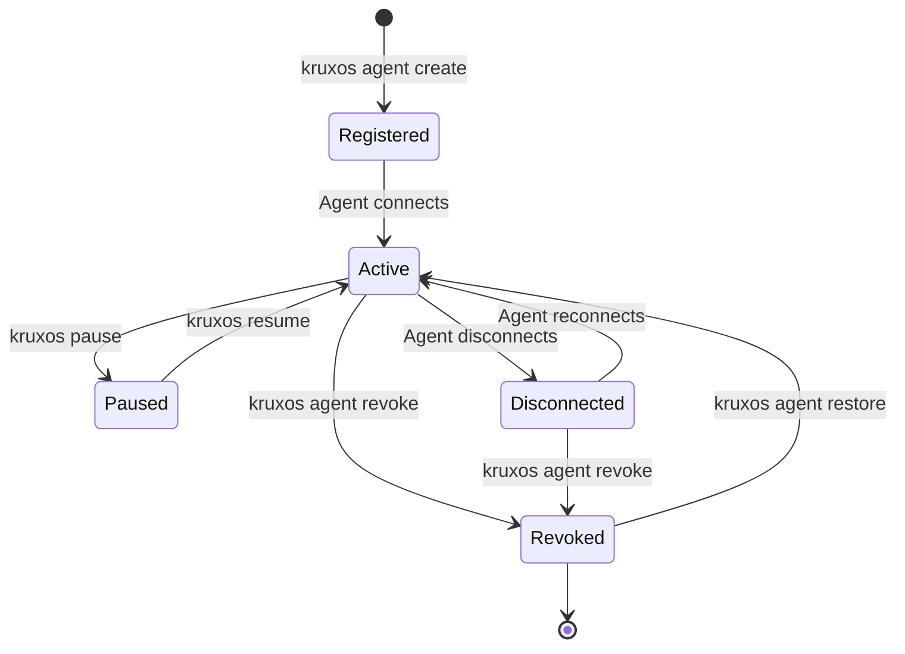

# Managing Agents

By the end of this page, you'll know how to create, monitor, and manage agents throughout their lifecycle.

## Agent lifecycle



## Create an agent

Each agent gets a unique name and API key. Create agents for different purposes:

```bash
# General-purpose agent
kruxos agent create --name my-agent --purpose "General assistant"

# Dedicated deployment agent
kruxos agent create --name deploy-bot --purpose "CI/CD automation"

# Monitoring agent
kruxos agent create --name monitor --purpose "System health monitoring"
```

!!! tip "One agent per purpose"
    Create separate agents for different tasks. Each agent gets its own state, audit trail, and policy scope. This makes it easy to revoke access or adjust permissions for a specific use case.

## Monitor agents

### CLI

```bash
# Quick overview
kruxos agent list

# Detailed view for one agent
kruxos agent show deploy-bot

# Live dashboard (auto-refreshing)
kruxos agents
```

### Dashboard

Navigate to **Agents** in the web dashboard at `https://localhost:7800/agents`. You'll see:

- Connection status — `active` (connected), `paused` (session frozen), `revoked` (disabled), or `disconnected` (registered but not currently connected)
- Session duration
- Invocation count and last activity
- Model-provider override (inline-editable)
- Quick actions (pause, resume, kill, rotate key, revoke, restore)

#### Agent detail page

Click an agent row to open its detail page (`/agents/<name>`). The detail page renders five tabs above an action bar:

| Tab | What's there |
|-----|--------------|
| **Overview** | Stats grid (last seen / invocations / errors), model-provider selector with default-effort + token-budget config, context-management presets, standing instructions |
| **Identity** | `Agent.md` editor with character and token counters, draft → save flow with revert |
| **Policy** | Summary card, trash-retention quick input, visual policy editor + YAML preview/edit toggle, delete-confirm flow |
| **Host Access** | Per-agent mount points under `/mnt/<label>` with staged add-mount dialog |
| **State** | Searchable key-value explorer with quota meter, expandable entries, version history, edit + delete actions |

The action bar above the tabs carries **Pause / Resume / Run Now / Kill / Rotate Key / Revoke**. When an agent is `revoked`, all controls become read-only and a banner offers to restore it.

### Live activity

Watch what an agent is doing in real time:

```bash
# All agents
kruxos watch

# Filter to one agent
kruxos watch --agent deploy-bot
```

## Session management

In v0.0.1 the session-control subcommands live at the top level of the CLI (`kruxos pause / resume / kill <name>`), not under a `kruxos session` namespace.

### Pause an agent

Temporarily freeze an agent's session. All capability calls return `SessionPaused` errors until resumed:

```bash
kruxos pause my-agent
```

The agent stays connected but cannot invoke capabilities.

### Resume an agent

```bash
kruxos resume my-agent
```

### Kill a session

Force-disconnect an agent:

```bash
kruxos kill my-agent
```

The agent can reconnect with the same token. To permanently block reconnection, revoke the agent.

## Credential management

### Rotate API key

If an API key may be compromised, rotate it immediately:

```bash
kruxos agent rotate my-agent
```

This invalidates the old key and issues a new one. The agent will need to be reconfigured with the new key.

### Revoke an agent

Disable an agent. Active sessions are terminated, the API key is invalidated, and the agent cannot reconnect until restored:

```bash
kruxos agent revoke deploy-bot
```

The agent's state, audit logs, identity, and policy are preserved on revoke.

### Restore an agent

Reactivate a previously-revoked agent. State, identity, policy, and host mounts are restored alongside; a new API key is issued (the old key stays invalidated):

```bash
kruxos agent restore deploy-bot
```

You can also restore from the Agents list in the dashboard — revoked rows expose a Restore action.

## Agent state

Each agent has its own persistent state (key-value store) that survives disconnections:

```bash
# List state keys
kruxos state list my-agent

# Read a value
kruxos state get my-agent last_deploy

# Set a value (for debugging)
kruxos state set my-agent debug_flag '{"enabled": true}'

# Delete a key
kruxos state delete my-agent debug_flag
```

State modifications via the CLI are audit-logged. This is a supervisory tool for debugging, not the primary way agents interact with state.

### State quotas

Each agent has a configurable state quota (default: 100 MB). Check usage:

```bash
kruxos state quota my-agent
```

Expected output:

```
Agent:     my-agent
Used:      2.4 MB / 100.0 MB (2.4%)
Keys:      47
```

## Context briefings

When an agent reconnects after a disconnection, KruxOS generates a **context briefing** — a summary of what changed while the agent was away:

- New approval decisions
- State changes by other agents (shared state)
- Policy updates
- System events (updates, restarts, service changes)

Briefings are rule-based and deterministic — no AI summarisation required. The agent receives the briefing automatically on reconnect via `agent.briefing`.

## Next steps

- [Approval Workflow](approval-workflow.md) — handle operations that need human review
- [Policies](policies.md) — control what each agent can do
- [Monitoring](monitoring.md) — health checks and alerts
