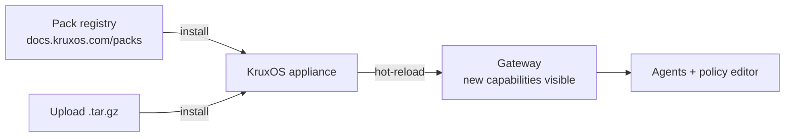

# Managing Packs

By the end of this page, you'll know how to browse, install, upgrade, and remove capability packs on your KruxOS appliance.

**Packs** extend KruxOS with new typed capabilities — weather lookups, RSS feeds, custom integrations, and more. Pack code runs inside the same per-agent sandbox as built-in capabilities, so installing a pack doesn't weaken isolation.



## Browse installed packs

Open **Packs** in the dashboard sidebar. The page shows:

- **Registry** tab — browse packs from the community registry with search and one-click install.
- **Installed** tab — packs currently on your appliance with version, capability count, and remove action.

Each installed pack's capabilities appear immediately in the policy editor and in `tools/list` for connected agents — no gateway restart needed.

## Install a pack

=== "From the registry (dashboard)"

    1. Open **Packs → Registry**.
    2. Search or scroll to find a pack.
    3. Click **Install**. KruxOS downloads, verifies, and installs the pack.
    4. The pack moves to the **Installed** tab with a success toast.

=== "Upload a local pack (dashboard)"

    1. Open **Packs → Installed**.
    2. Click **Upload pack** and select a `.tar.gz` pack archive.
    3. Or copy the file to `/data/kruxos/uploads/` via the [Uploads](../quickstart/dashboard.md) page and paste the path.

=== "CLI"

    ```bash
    # Search the registry
    kruxos pack search weather

    # Install from registry by name
    kruxos pack install kruxos-rss-fetch

    # Install from a local directory or tarball
    kruxos pack install ./my-pack
    kruxos pack install /data/kruxos/uploads/my-pack.tar.gz

    # List installed packs
    kruxos pack list
    ```

## Upgrade a pack

When a newer version is available in the registry, the **Installed** tab shows an **Upgrade** button:

```bash
# CLI equivalent
kruxos pack update kruxos-rss-fetch
```

Upgrading replaces the pack's capabilities in place. Agents pick up the new definitions on their next `tools/list` call.

## Remove a pack

=== "Dashboard"

    On **Packs → Installed**, click **Remove** on the pack card. Confirm in the dialog.

=== "CLI"

    ```bash
    kruxos pack remove kruxos-rss-fetch
    ```

Removed pack capabilities disappear from the policy editor and from agent tool lists immediately.

## Policy and packs

Each pack capability has a default policy tier (autonomous, notify, approval_required, or blocked). You can override tiers in:

- **System policy** — affects all agents
- **Per-agent policy** — on the agent's **Policy** tab
- **User policy** — on the **Identities** page

Pack capabilities show up in the visual policy editor with a pack badge so you can tell them apart from built-in capabilities.

## Build your own pack

See the developer docs:

- [Pack Quickstart](../developers/packs/quickstart.md) — create a pack in 10 minutes
- [Capability Design Guidelines](../pack-authors/capability-design-guidelines.md) — write AI-efficient capability definitions
- [Publishing](../developers/packs/publishing.md) — share your pack with the community

## Troubleshooting

| Symptom | Fix |
|---------|-----|
| Install fails with checksum error | Re-download the pack; verify the tarball isn't corrupted |
| Capability not visible to agent | Check policy — the tier may be `blocked`; also confirm the pack shows in **Installed** |
| `pack search` returns nothing | Confirm outbound network access from the appliance, or install from a local path |
| Upload too large | Use the **Uploads** page (streams to disk) instead of browser upload for multi-GB archives |

## Next steps

- [Pack Development Quickstart](../developers/packs/quickstart.md)
- [Policies](policies.md) — control which pack capabilities agents can use
- [File Transfer](file-transfer.md) — get pack archives onto the appliance