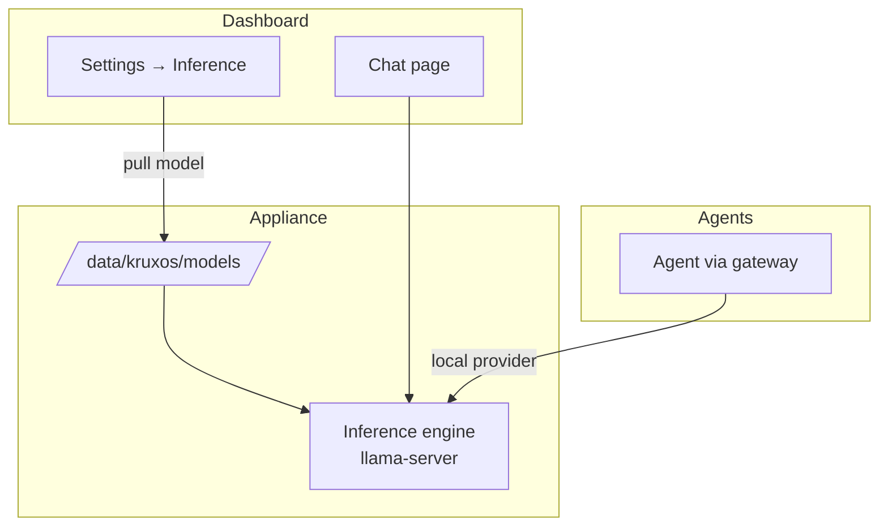

# On-Appliance Inference

By the end of this page, you'll know how to run local AI models directly on your KruxOS appliance — no external Ollama server required.

KruxOS ships a built-in inference engine (llama.cpp) that runs GGUF models on the appliance itself. Models are pulled from a curated catalog, stored under `/data/kruxos/models/`, and exposed to agents through the same model-provider system as Claude or OpenAI.



## Before you start

- The appliance is running and the vault is unlocked.
- You have enough disk space — a 3B model needs roughly 2–3 GB; larger models need more. Check **Health** for disk usage.
- For GPU acceleration, install a driver first (see [GPU Drivers](gpu-drivers.md)).

## Pull your first model

=== "Dashboard"

    1. Open **Settings → Inference**.
    2. Browse the **catalog** — each entry shows the model name, size, and license.
    3. Click **Pull** on a model. A progress bar tracks the download.
    4. When the pull completes, the model appears under **Installed models** with a **Ready** status.

=== "CLI"

    ```bash
    # List available models in the catalog
    kruxos inference catalog

    # Pull a model by catalog ID
    kruxos inference pull phi-3-mini

    # Check engine status
    kruxos inference status
    ```

## Use the model

Once a model is pulled, KruxOS auto-registers it as a **Local** model provider. You can:

- **Chat** — open **Chat** in the dashboard, select the local model from the model picker, and send a message.
- **Assign to an agent** — on an agent's **Overview** tab, set the model provider to the local model.
- **Set as system default** — on **Settings → Models**, click **Set Default** next to the local provider for the chat, autonomous, or fallback role.

!!! tip "Test the provider"
    On **Settings → Models**, click **Test** on the local provider card. A successful test returns generated text and confirms the engine is healthy.

## Tune performance

The inference engine reads optional overrides from `/data/kruxos/inference.env`. Copy the template to get started:

```bash
cp /opt/kruxos/inference/inference.env.example /data/kruxos/inference.env
```

Common settings:

| Variable | Default | When to change |
|----------|---------|----------------|
| `KRUXOS_INFERENCE_PARALLEL` | `1` | Raise only if you serve concurrent requests and your host handles the load |
| `KRUXOS_INFERENCE_THREADS` | auto (physical cores) | Set to `2` on a small shared VM if inference makes the appliance laggy |
| `KRUXOS_INFERENCE_POLL` | `50` | Try `100` on virtualized hosts if chat turns hang |
| `KRUXOS_INFERENCE_EXTRA_ARGS` | (none) | Advanced llama-server flags, e.g. `--ctx-size 8192` |

After editing, restart the engine:

```bash
systemctl restart kruxos-inference
```

!!! warning "Small VMs can struggle"
    On a 4-vCPU VM, inference with too many threads can spike softirq CPU and make the whole appliance feel sluggish. Start with the defaults; if `/chat` hangs, set `KRUXOS_INFERENCE_THREADS=2` and restart.

## GPU vs CPU

| Mode | How to enable | When to use |
|------|---------------|-------------|
| **CPU** | Default — works out of the box | Demo, small models, no NVIDIA GPU |
| **GPU** | Install driver → **Enable GPU inference** on Hardware or Inference page | Production local inference on NVIDIA hardware |

The engine falls back to CPU automatically if the GPU driver is missing or incompatible after an update.

## Troubleshooting

| Symptom | Fix |
|---------|-----|
| Model pull fails (disk full) | Free space under `/data` or use a smaller model |
| Chat hangs after sending a message | Reduce `KRUXOS_INFERENCE_THREADS`; check **Health** for CPU saturation |
| Engine shows **Degraded** | Run `kruxos inference status` for details; restart with `systemctl restart kruxos-inference` |
| Model not in agent's tool list | Confirm the local provider is assigned on the agent's Overview tab |

## Next steps

- [GPU Drivers](gpu-drivers.md) — accelerate inference with an NVIDIA GPU
- [Connect Local Models](../quickstart/connect-local.md) — connect external Ollama/vLLM instead
- [Model Providers](model-providers.md) — mix local and cloud providers