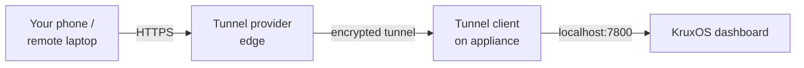

# Remote Access

By the end of this page, you'll know how to reach your KruxOS dashboard from outside its local network using a tunnel, and how to do it without widening your attack surface more than necessary.

The dashboard binds to port `7800` on the appliance. On the same LAN you reach it at `https://<appliance-ip>:7800`. To reach it from anywhere else — your phone on cellular, a laptop on another network, a teammate's machine — you run a **tunnel client on the appliance** that publishes the dashboard outward.

!!! info "KruxOS doesn't ship a relay"
    There is no hosted KruxOS relay. You bring your own tunnel: a small client runs on the appliance, dials out to the tunnel provider, and exposes the dashboard at a URL you can reach remotely. The recipes below cover the three most common choices. All three dial **outbound**, so you don't need to open inbound ports on your router.

## Why you'd want this

- **Phone access** — check on agents, approve operations, or read the audit log while you're away from home.
- **Team collaboration** — let a collaborator review approvals or activity without onboarding them to your LAN.
- **Mobile editing** — monitor and steer agents from a laptop on a different network.

Preview URLs and anything else that hangs off the dashboard URL work for free once the dashboard itself is reachable.



## Before you start

The dashboard is **login- and bearer-gated**, but exposing it beyond the LAN still widens your attack surface. Two rules keep that surface small:

1. **Expose only port `7800`.** The loopback **User API** and the other internal services are bound to `localhost` by design — do **not** add tunnel routes for them. Tunnel the dashboard and nothing else.
2. **Add a tunnel-level identity gate** wherever the tool supports one (tailnet ACLs, Cloudflare Access, ngrok OAuth/basic-auth). This puts an authentication check *in front of* the dashboard's own login, so unauthenticated traffic never reaches KruxOS.

!!! warning "The dashboard uses a self-signed certificate"
    KruxOS serves the dashboard over HTTPS with an auto-generated self-signed certificate. When a tunnel connects to `https://localhost:7800` it must be told to accept that certificate (each recipe shows how). When a tunnel provider terminates TLS for you with a trusted certificate (Tailscale Serve, Cloudflare), remote browsers see a clean certificate even though the origin is self-signed.

## Choosing a tool

| Tool | Best for | URL stability | Exposure | Access control |
|------|----------|---------------|----------|----------------|
| **Tailscale** | Personal use, your own devices | Stable MagicDNS name | Private — tailnet only | Tailnet membership + ACLs |
| **Cloudflare Tunnel** | Sharing with external collaborators | Stable hostname (with a domain) | Public hostname | Cloudflare Access (identity) |
| **Ngrok** | Quick demos / short sessions | Random (free) / reserved (paid) | Public URL | OAuth / basic-auth (plan-dependent) |

For a single operator and their own devices, **Tailscale** is the best fit for KruxOS's trusted-devices model. To share with people outside a tailnet, reach for **Cloudflare Tunnel**. For a one-off demo, **Ngrok** is the quickest to stand up.

## Recipe 1: Tailscale

Tailscale builds a private WireGuard network (a "tailnet") across your devices. Traffic is end-to-end encrypted and never touches the public internet — the appliance is reachable only by devices you've added to your tailnet.

### Install and join the tailnet

On the appliance:

```bash
curl -fsSL https://tailscale.com/install.sh | sh
sudo tailscale up
```

`tailscale up` prints an authentication URL. Open it, sign in, and the appliance joins your tailnet. Confirm it's connected:

```bash
tailscale status
tailscale ip -4
```

### Reach the dashboard

With MagicDNS enabled (the default), the appliance gets a stable name. From any other device on the tailnet, open:

```
https://<hostname>.<tailnet>.ts.net:7800
```

For example `https://kruxos.tail9b2c.ts.net:7800`. Because the dashboard's certificate is self-signed, your browser will warn about it on this direct path — that's expected.

### Optional: clean HTTPS with Tailscale Serve

To drop the certificate warning and the port number, let Tailscale terminate TLS with a trusted certificate and proxy to the dashboard. First enable HTTPS certificates for your tailnet (admin console → **DNS** → enable MagicDNS and HTTPS), then on the appliance:

```bash
sudo tailscale serve --bg https+insecure://localhost:7800
```

- `https+insecure://` tells Serve to connect to the dashboard's self-signed origin without verifying it.
- `--bg` runs the proxy in the background so it survives reboots.

The dashboard is now at `https://<hostname>.<tailnet>.ts.net/` with a browser-trusted certificate. Check or remove the configuration with:

```bash
tailscale serve status
tailscale serve reset      # remove all serve config
```

### Access control and revocation

- Only devices on your tailnet can reach the appliance — it is never exposed to the public internet.
- Restrict *which* tailnet users or devices may reach port `7800` with **ACLs** (admin console → **Access Controls**).
- Avoid `tailscale funnel` for the dashboard — Funnel publishes the service to the public internet, which defeats the private tailnet model.
- **Revoke** by removing the device or user in the admin console, or run `sudo tailscale logout` on the appliance to drop it from the tailnet.

### Cost

Free for personal use (up to 100 devices on the Personal plan) — ample for one operator and their devices.

## Recipe 2: Cloudflare Tunnel

`cloudflared` opens an outbound tunnel from the appliance to Cloudflare's edge and serves the dashboard at a Cloudflare URL. No inbound port-forwarding, and TLS is handled at the edge. It's a good fit for sharing with people outside a tailnet.

### Install cloudflared

On a Debian/Ubuntu appliance, use Cloudflare's package repository:

```bash
curl -fsSL https://pkg.cloudflare.com/cloudflare-main.gpg | sudo tee /usr/share/keyrings/cloudflare-main.gpg >/dev/null
echo "deb [signed-by=/usr/share/keyrings/cloudflare-main.gpg] https://pkg.cloudflare.com/cloudflared $(lsb_release -cs) main" | sudo tee /etc/apt/sources.list.d/cloudflared.list
sudo apt-get update && sudo apt-get install cloudflared
```

For other platforms, install the `cloudflared` binary from Cloudflare's downloads page.

### Option A: Quick tunnel (no account)

For a throwaway URL with zero setup:

```bash
cloudflared tunnel --url https://localhost:7800 --no-tls-verify
```

This prints a random `https://<random>.trycloudflare.com` URL that proxies to your dashboard. `--no-tls-verify` lets `cloudflared` connect to the self-signed origin. The URL changes every run and has no access control of its own, so treat it as short-lived and rely on the dashboard login.

### Option B: Named tunnel (persistent hostname)

For a stable hostname you need a domain managed in Cloudflare (a zone — a free plan is fine).

```bash
cloudflared tunnel login          # browser auth; pick your zone
cloudflared tunnel create kruxos  # creates the tunnel + a credentials file
```

Create `~/.cloudflared/config.yml`:

```yaml
tunnel: <TUNNEL-ID>
credentials-file: /home/<user>/.cloudflared/<TUNNEL-ID>.json

ingress:
  - hostname: kruxos.example.com
    service: https://localhost:7800
    originRequest:
      noTLSVerify: true
  - service: http_status:404
```

`noTLSVerify: true` accepts the dashboard's self-signed certificate. The catch-all `http_status:404` ensures only the one hostname routes anywhere. Point DNS at the tunnel and run it:

```bash
cloudflared tunnel route dns kruxos kruxos.example.com
cloudflared tunnel run kruxos
```

To start the tunnel on boot, install it as a service:

```bash
sudo cloudflared service install
```

### Add an identity gate (recommended)

A named hostname is reachable by anyone who knows the URL. Put **Cloudflare Access** in front of it so only authorized identities reach the dashboard at all. In the Cloudflare Zero Trust dashboard, add a self-hosted application for `kruxos.example.com` and an Access policy — for example, allow only specific email addresses, or require your SSO/identity provider. The check runs at Cloudflare's edge, before traffic ever reaches KruxOS.

### Access control and revocation

- Only the `kruxos.example.com → :7800` ingress is exposed. Don't add ingress rules for the User API or other ports.
- Layer Cloudflare Access for an identity gate.
- **Revoke** with `cloudflared tunnel delete kruxos`, or remove the DNS record / disable the Access application to cut access immediately.

### Cost

`cloudflared` and Cloudflare Tunnel are free. Cloudflare Access has a free tier (up to 50 users). A named hostname requires a domain on a Cloudflare zone.

## Recipe 3: Ngrok

Ngrok is the fastest way to get a public URL for a short session. It's less production-grade than the first two — the free URL is random and rotates — but it's ideal for a quick demo.

### Install and authenticate

Install the agent (for example `sudo snap install ngrok`, or download the binary from `ngrok.com/download`), then register your authtoken:

```bash
ngrok config add-authtoken <YOUR_AUTHTOKEN>
```

### Start a tunnel

```bash
ngrok http https://localhost:7800
```

Ngrok prints a public `https://<random>.ngrok-free.app` forwarding URL pointing at your dashboard. On the free tier the URL changes each session and first-time visitors see an interstitial warning page.

### Add edge auth (recommended)

Gate the tunnel at ngrok's edge so traffic is challenged before it reaches the dashboard:

```bash
# HTTP basic auth
ngrok http https://localhost:7800 --basic-auth "operator:strong-password"

# or OAuth (Google), restricted to specific accounts
ngrok http https://localhost:7800 --oauth google --oauth-allow-email you@example.com
```

Availability of edge auth options depends on your ngrok plan — check ngrok's current pricing.

### Access control and revocation

- The tunnel exposes only the dashboard you pointed it at; don't start additional tunnels for internal ports.
- **Revoke** by stopping the `ngrok` process (the URL dies with it) and, for longer-lived setups, rotating the authtoken from the ngrok dashboard.

### Cost

Free tier: a random URL per session, an interstitial warning page, and usage limits. Paid plans add reserved/custom domains and remove the interstitial.

## Security considerations

- **The dashboard is gated, but exposure still matters.** Login and bearer auth protect the dashboard, yet any remotely reachable surface should be treated as internet-facing. Prefer private (tailnet) or identity-gated (Cloudflare Access, ngrok OAuth) access over a fully public random URL for anything beyond a throwaway demo.
- **Expose the dashboard port only.** Never tunnel the loopback User API or other internal services — they bind to `localhost` by design and must stay that way.
- **Harden the basics.** Use a strong vault passphrase and rotate your `krx_user_*` tokens; revoke a token immediately if it may have leaked.
- **Tear down tunnels you're not using.** Each recipe has a revoke step — run it when remote access is no longer needed.

## Troubleshooting

| Symptom | Fix |
|---------|-----|
| Browser certificate warning | Expected on direct Tailscale access (self-signed origin). Use Tailscale Serve or Cloudflare to present a trusted certificate, or terminate TLS upstream with your own certificate. |
| Connection refused / page won't load | Confirm the dashboard is up on the appliance (`https://localhost:7800`) and the tunnel client is running (`tailscale status`, `cloudflared tunnel info <name>`, or the ngrok session log). |
| DNS not resolving (Cloudflare named tunnel) | Make sure `cloudflared tunnel route dns ...` succeeded and the CNAME exists in your zone; propagation can take a minute. |
| Tunnel client can't connect | All three dial outbound, so router port-forwarding isn't needed — instead check that outbound `443` egress isn't blocked by a firewall. |
| Ngrok upstream TLS error | Point at `https://localhost:7800`; if ngrok rejects the self-signed origin, prefer Tailscale or Cloudflare Tunnel (which accept it explicitly), or serve the dashboard behind a trusted upstream certificate. |

## Next steps

- [Monitoring](monitoring.md) — watch health and activity once you can reach the dashboard remotely
- [Web Dashboard](../quickstart/dashboard.md) — what each remotely accessible page does
- [Updating KruxOS](updating.md) — keep the appliance current
