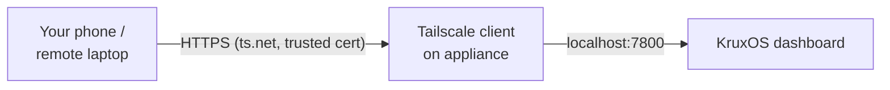

# Remote Access

By the end of this page, you'll be able to open your KruxOS dashboard from your phone or laptop anywhere — over your own private Tailscale network, with a valid HTTPS certificate, and with nothing exposed to the public internet.

KruxOS ships with [Tailscale](https://tailscale.com) built in (v0.0.3 and later). It is **off by default**. When you turn it on, the appliance joins **your own tailnet** — a private WireGuard network of just your devices — and publishes the dashboard at a stable address:

```
https://kruxos.<your-tailnet>.ts.net
```

Only devices signed in to **your** Tailscale account can connect. There is no public URL, no port-forwarding on your router, and no relay operated by KruxOS.

!!! info "Bring your own Tailscale account"
    You sign in with your own Tailscale account — the appliance never sees your password. The **Personal** tier is free and is ample for one operator and their devices. One caveat: signing up with a custom-domain email address classes the tailnet as business use on Tailscale's side; use a personal email address for the free Personal tier.

!!! note "The appliance needs a network of its own first"
    Remote access rides on whatever connection the appliance already has — Ethernet or Wi-Fi. Wireless is set up on the dashboard's **Network** page, or, on a machine that has no network at all yet, from the appliance console during setup: see [Joining Wi-Fi from the console](first-boot-wizard.md#joining-wi-fi-from-the-console).

## How it works


```mermaid
graph LR
    Phone[Your phone /<br/>remote laptop] -->|"HTTPS (ts.net, trusted cert)"| TS[Tailscale client<br/>on appliance]
    TS -->|localhost:7800| Dash[KruxOS dashboard]
```

The appliance runs the Tailscale client as an unprivileged system user and publishes **only the dashboard** (port `7800`) to your tailnet with `tailscale serve`. Tailscale terminates TLS with a real certificate for your `ts.net` name, so remote browsers get a clean green lock — no self-signed warning. The appliance's internal loopback services are fenced off from the tailnet by a firewall guard; the dashboard is the only thing your tailnet devices can reach.

## Turn it on

There are two ways in:

- **During first-boot setup** — the wizard offers an optional, skippable **Remote access** step. Choose **Enable + get login link**, or **Skip for now** and set it up later.
- **Any time after** — **Settings › System › Remote access (Tailscale)**. Click **Enable remote access** and confirm.

Either way, enabling starts the Tailscale client. The appliance then needs a **one-time login** to join your tailnet:

1. Click **Start login** (the wizard fetches the link automatically). A login link appears within a few seconds — if you see "still starting", wait a moment and try again; clicking again re-shows the same link.
2. Open the link **on the device you want to connect from** (your phone or laptop), sign in to your Tailscale account, and approve the machine.
3. Back on the card, the status flips to connected and shows your tailnet IP and `ts.net` address.

The wizard step never blocks setup — you can finish setup while the login is still pending and complete it later from Settings › System.

## The one-time consent page

The **first** time the dashboard is published on a fresh tailnet, Tailscale asks for a one-time consent in your browser. The card shows the consent link and a **Retry publish** button. On that page:

- **Enable HTTPS certificates** — this is the required half. It lets the appliance get a trusted certificate for its `ts.net` name. (The note about certificate names appearing in a public ledger is normal Let's Encrypt certificate-transparency behavior.)

!!! warning "Leave the Funnel checkbox UNCHECKED"
    The consent page also offers an optional **Tailscale Funnel** checkbox. **Leave it unchecked.** Funnel exposes services to the **public internet** — that is not what this feature is. KruxOS remote access keeps the dashboard private to your own tailnet devices.

After consenting, click **Retry publish**. The card shows your dashboard address once it's live.

## Use it

1. Install the Tailscale app on your phone or laptop ([tailscale.com/download](https://tailscale.com/download)) and sign in with the **same** account.
2. Open `https://kruxos.<your-tailnet>.ts.net` in the browser. That's it — the normal dashboard login applies, with a valid certificate.

The `ts.net` address works from any network — cellular, hotel Wi-Fi, the office — as long as the device is signed in to your tailnet. Approvals, monitoring, chat, and anything else that hangs off the dashboard work exactly as they do on your LAN.

## Pre-auth keys (alternative to the interactive login)

If you prefer not to click through the interactive login — for example when provisioning headlessly — you can join the tailnet with a **pre-auth key** instead. On the Settings card, expand **Use a pre-auth key instead** and paste a key (`tskey-…`).

Generate the key in the Tailscale admin console (**Settings › Keys**) with these options:

| Option | Setting |
|--------|---------|
| Reusable | Off — use a one-off key |
| **Pre-approved** | **On** — the node joins without a manual approval step |
| **Ephemeral** | **Off** — ephemeral nodes are removed when they disconnect, which is wrong for an appliance |
| Tags | Recommended — tagged nodes get key expiry disabled automatically |

The key is used once to join and is **never stored** by the appliance.

## Key expiry

Tailscale node keys expire after **180 days** by default. When your key is within 30 days of expiring, the Remote access card shows a warning with a one-click **Re-login** button — re-approving the login renews the key.

To avoid the renewal cycle entirely, either turn on **Disable key expiry** for the appliance in the Tailscale admin console (Machines › your appliance), or join with a **tagged** pre-auth key (tagged nodes don't expire).

## SSH over Tailscale

The Remote access card has a default-off **Allow SSH over Tailscale** toggle. It lets the opt-in SSH console (the **SSH access** card on the same page) accept connections over your tailnet too — useful for reaching a shell on the appliance from outside your LAN.

The toggle only has an effect while SSH access is **enabled** on its own card — it just widens the tailnet firewall to include SSH; the same key-only login still applies, and password login is never accepted.

## Turning it off

Click **Disable remote access** on the Settings card. The `ts.net` address stops working immediately. If you're connected to the dashboard over the tailnet at that moment you'll drop your session — reach it again on your LAN. Your Tailscale login is kept, so re-enabling reconnects without signing in again.

To remove the appliance from your tailnet entirely, also delete the machine in the Tailscale admin console.

## Troubleshooting

| Symptom | Fix |
|---------|-----|
| Login link doesn't appear | It usually appears within a few seconds. If the card says "still starting", wait a moment and click **Start login** again — it re-shows the same pending link. You can always finish later from Settings › System. |
| Enable or login fails outright | The appliance needs **outbound HTTPS (443)** and working **DNS** to reach the Tailscale coordination service. Check the appliance's internet access — no inbound ports are required. |
| The appliance isn't on a network yet | There is nothing for remote access to ride on. Plug in Ethernet, or join Wi-Fi from the **Network** page — or from the console if you can't reach the dashboard at all ([Joining Wi-Fi from the console](first-boot-wizard.md#joining-wi-fi-from-the-console)). |
| "Publishing to your tailnet…" lingers | Normal for a few seconds after connecting or after a restart while the serve state settles. Use **Publish now** if it doesn't clear. |
| `ts.net` URL doesn't load on your phone | Confirm the phone's Tailscale app is running and signed in to the **same** account, and that the card shows connected with the address published. |
| Node key expired | The card shows an expired warning — click **Re-login** and approve the login again. Consider disabling key expiry (above). |
| Certificate warning in the browser | The `ts.net` address should present a trusted certificate. If you're browsing the appliance by tailnet IP (`https://100.x.y.z:7800`) instead, a self-signed warning is expected — use the `ts.net` address. |

## Appendix: DIY alternatives (advanced)

Before remote access was built in, this page documented bring-your-own tunnel recipes. They remain workable **advanced, unsupported** alternatives if the Tailscale model doesn't fit you. Note that the appliance image is a fixed, read-only system with no package manager — run the tunnel client on **another machine on your LAN** and point it at the dashboard (`https://<appliance-ip>:7800`, a self-signed origin). Whatever you use: expose **only** port `7800`, and put an identity gate in front wherever the tool supports one.

**Cloudflare Tunnel** — `cloudflared` dials outbound to Cloudflare's edge and serves the dashboard at a hostname on a domain you manage in Cloudflare (free plan is fine). Set `noTLSVerify: true` for the self-signed origin, route a single hostname to `https://<appliance-ip>:7800`, and put **Cloudflare Access** in front so only authorized identities reach the dashboard. Suits sharing with collaborators you don't want on a tailnet — but understand it creates a public hostname; the identity gate is doing the protecting.

**ngrok** — quickest for a short demo: `ngrok http https://<appliance-ip>:7800` prints a public URL (random on the free tier, with an interstitial page). Add `--basic-auth` or `--oauth` edge auth if your plan supports it. Kill the process to revoke. Not recommended beyond throwaway sessions.

**Headscale** — a self-hosted, open-source implementation of the Tailscale control server, for operators who don't want the hosted coordination service. KruxOS's built-in flow assumes the hosted service and can't be pointed at a Headscale server, and Headscale has no Serve/Funnel — so there is no turnkey `ts.net` HTTPS URL; you'd be building tailnet connectivity to `https://<appliance-ip>:7800` yourself from your own devices. Strictly for advanced users comfortable operating their own coordination server.

## Next steps

- [Monitoring](monitoring.md) — watch health and activity once you can reach the dashboard remotely
- [Web Dashboard](../quickstart/dashboard.md) — what each remotely accessible page does
- [Updating KruxOS](updating.md) — keep the appliance current
