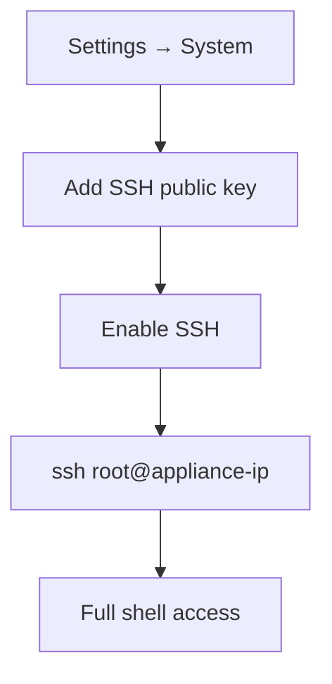

# SSH Access

By the end of this page, you'll know how to enable SSH on your KruxOS appliance, add your public key, and connect securely.

SSH is **opt-in and off by default**. KruxOS does not open port 22 until you explicitly enable it and add at least one authorized public key. This keeps the default attack surface small while still giving operators a familiar remote shell when they need one.



## Enable SSH

1. Open **Settings → System** in the dashboard.
2. Find the **SSH access** card.
3. Paste your **public key** (e.g. `ssh-ed25519 AAAA… user@host`) into the key field and click **Add key**.
4. Click **Enable SSH**. A confirmation dialog explains that SSH binds on all interfaces and is gated by your firewall rules.

The card shows the exact command to connect:

```
ssh root@<appliance-ip>
```

!!! warning "Root access"
    SSH connects as `root` with full appliance access. Use a strong key (ed25519 recommended), protect your private key, and disable SSH when you no longer need it.

## Add or remove keys

- **Add** — paste another public key and click **Add key**. Multiple keys are supported (one per operator or device).
- **Remove** — click the delete icon next to a key in the list. You cannot enable SSH with zero keys.

Accepted key types: `ssh-ed25519`, `ssh-rsa`, `ecdsa-sha2-nistp256`, and FIDO2 security keys (`sk-ssh-ed25519@openssh.com`, `sk-ecdsa-sha2-nistp256@openssh.com`).

## Disable SSH

Click **Disable SSH** on the same card. This stops `kruxos-sshd.service` immediately. Your authorized keys are preserved — re-enabling SSH doesn't require re-adding them.

## SSH over Tailscale (optional)

If you use the built-in [Tailscale remote access](remote-access.md#built-in-tailscale-recommended), you can optionally allow SSH over your tailnet:

1. On **Settings → System → Remote access**, enable Tailscale and complete login.
2. Toggle **Allow SSH over Tailscale** (default off).
3. Connect from any device on your tailnet: `ssh root@<hostname>.<tailnet>.ts.net`

This exposes SSH only to your tailnet peers, not the public internet. Firewall rules restrict tailnet traffic to ports 7800 (dashboard) and optionally 22 (SSH).

## First-boot wizard

The first-boot wizard includes an optional **SSH key** step. If you add a key during onboarding, SSH is ready to enable later from Settings — you don't have to re-enter the key.

## Security considerations

- SSH is independent of the vault passphrase — you can enable SSH even when the vault is locked (the SSH API only touches `/data/kruxos/ssh/authorized_keys`).
- Disable SSH when not in use. Each enabled day is another surface to monitor.
- Prefer Tailscale + SSH over Tailscale over exposing port 22 to your LAN or the internet.
- Rotate keys by removing the old key and adding a new one.

## Troubleshooting

| Symptom | Fix |
|---------|-----|
| Can't connect — connection refused | Confirm SSH is **Enabled** on the Settings card; check `systemctl status kruxos-sshd` |
| Permission denied (publickey) | Verify your private key matches an authorized key on the card; check you're connecting as `root` |
| Key rejected on paste | Ensure you pasted the **public** key (one line, starts with `ssh-ed25519` or `ssh-rsa`) |
| Enable button greyed out | Add at least one public key first |

## Next steps

- [Remote Access](remote-access.md) — reach the dashboard from outside your LAN
- [File Transfer](file-transfer.md) — alternative ways to move files onto the appliance
- [CLI Guide](../quickstart/cli.md) — manage KruxOS from the shell once connected