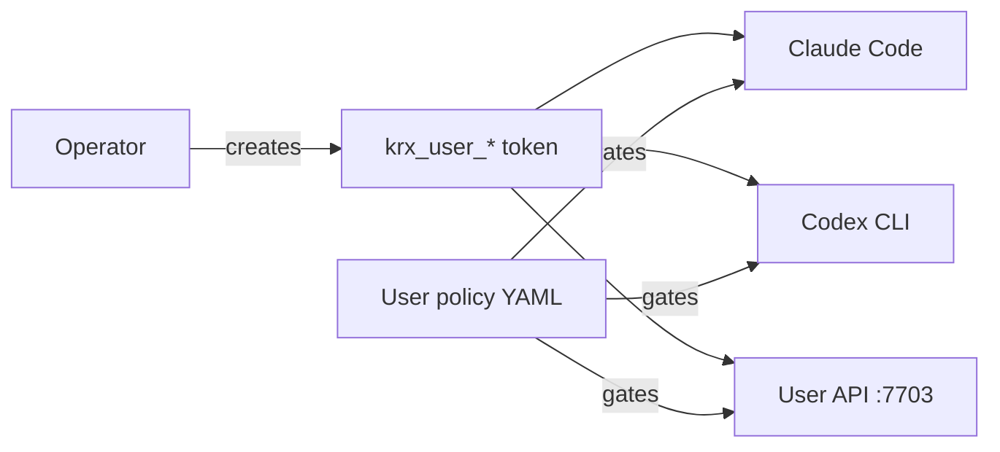

# User Identities & Tokens

By the end of this page, you'll know how to manage User bearer tokens and user-level policy rules on your KruxOS appliance.

The **User** principal is you — the operator. User tokens authenticate host CLIs (Claude Code, Codex), the loopback User API, and dashboard actions that run as the operator. User policy rules apply to every tool call those clients make.



## Open the Identities page

In the dashboard sidebar, click **Identities** (`/identities`). The page has two sections:

1. **User tokens** — bearer tokens for authentication
2. **User policy** — YAML rules that gate operator-initiated tool calls

!!! note "Vault must be unlocked"
    If the vault is locked, both sections show a "Vault is locked" banner instead of data. Unlock the vault from any page that prompts you.

## Create a token

=== "Dashboard"

    1. On **Identities**, click **New token**.
    2. Enter a friendly name (e.g. `laptop`, `ci-pipeline`).
    3. The raw `krx_user_*` bearer is shown **once**. Copy it immediately — it cannot be retrieved later.
    4. Check the acknowledgement box and continue.

=== "CLI"

    ```bash
    kruxos user-token create laptop-2026
    # Prints the raw krx_user_* token exactly once
    ```

Store the token securely. Use it via:

- `KRUXOS_USER_TOKEN` environment variable (recommended — never pass on the command line)
- The vault label (for `mcp-bridge` and `cli-hook`, which read from the vault automatically)

## List and revoke tokens

=== "Dashboard"

    The token table shows name, created date, last used, and status. Click **Revoke**, type the token name to confirm, and the token is invalidated immediately.

=== "CLI"

    ```bash
    kruxos user-token list
    kruxos user-token revoke <token-id>
    ```

Revocation takes effect on the next gateway handshake — no grace period for stale connections.

## Edit user policy

User policy gates tool calls from host CLIs and the User API. It sits alongside (not instead of) system and per-agent policies.

1. On **Identities**, find the **User policy** section.
2. Click **Edit** to open the YAML editor.
3. Write rules using the same syntax as [system policies](policies.md).
4. Save — changes hot-reload without a gateway restart.

Example — require approval for all filesystem writes from host CLIs:

```yaml
rules:
  - match:
      capability: "filesystem.write"
    tier: approval_required
```

### Trash retention

The **Trash retention** field sets how long soft-deleted items are kept before permanent cleanup (default: 168 hours / 7 days). Leave blank to use the default, or enter a positive integer in hours.

## When to create multiple tokens

| Scenario | Approach |
|----------|----------|
| One operator, one laptop | Single token from the first-boot wizard is enough |
| Multiple devices | Create a named token per device so you can revoke one without affecting others |
| CI pipeline | Dedicated token with a restrictive user policy |
| Compromised token | Revoke immediately; create a new one |

## First-boot wizard

The wizard's **User token** step generates your first bearer automatically. If you skipped it or lost the token, create a new one on the Identities page — the wizard token and new tokens work the same way.

## Next steps

- [Host CLI Integrations](host-cli-integrations.md) — wire Claude Code and Codex to your token
- [Admin CLI Commands](admin-cli.md) — full `user-token` reference
- [Policies](policies.md) — policy syntax and tiers