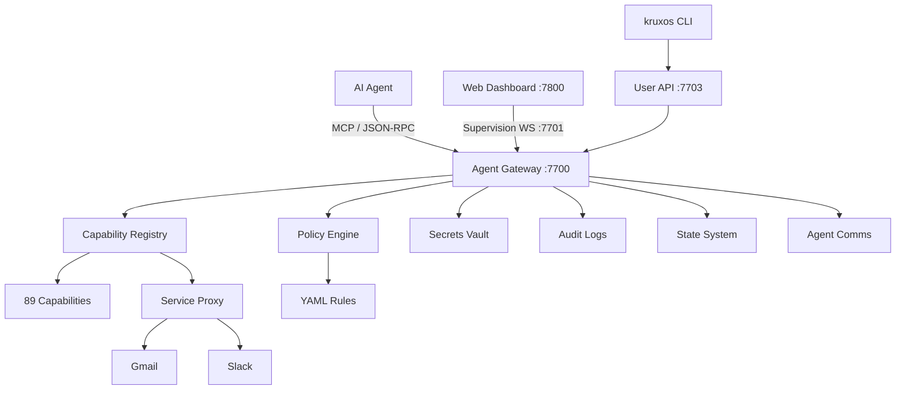

# KruxOS

**The operating system built for AI agents.**

KruxOS replaces the traditional Linux command line with typed, documented, governable APIs. Every OS operation — reading files, running processes, sending emails, managing secrets — is a structured capability that agents discover, invoke, and get structured results from.

No shell parsing. No permission guessing. No silent failures.

---

## Who is KruxOS for?

<div class="grid cards" markdown>

-   :material-account:{ .lg .middle } **Users**

    ---

    Get KruxOS running, connect your AI agent, and start using it in under 15 minutes.

    [:octicons-arrow-right-24: Quickstart](quickstart/install.md)

-   :material-shield-lock:{ .lg .middle } **Enterprise**

    ---

    Evaluate KruxOS for production: security model, compliance, architecture, and benchmarks.

    [:octicons-arrow-right-24: Enterprise Overview](enterprise/index.md)

-   :material-code-braces:{ .lg .middle } **Developers**

    ---

    Build capability packs, use the Python SDK, and contribute to KruxOS.

    [:octicons-arrow-right-24: Developer Guide](developers/index.md)

</div>

---

## Why KruxOS?

### The problem

AI agents running on traditional Linux spend **40-60% of their tokens** parsing shell output, handling text errors, and guessing at permissions. Every command is a string. Every response is unstructured text. Every error is a surprise.

### The solution

KruxOS exposes every OS operation as a **typed, documented API**:

| Traditional Linux | KruxOS |
|---|---|
| `ls -la /workspace` (parse text output) | `filesystem.list(path="/workspace")` (structured JSON) |
| `echo $?` (check exit code) | Structured error with type, description, recovery actions |
| `chmod 755 file` (hope it works) | Policy engine evaluates permission in real time |
| `grep -r "password" .env` (secrets in plaintext) | Vault injects secrets at runtime, agent never sees raw values |
| No audit trail | Every operation hash-chained to append-only audit log |

### Key features

- **89 typed capabilities across 13 categories** — filesystem, process, network, git, scheduler, system, agent, state, comms, secrets, email, Slack, alerts. MCP-native (`tools/list`) with JSON-RPC fallback (`capabilities.list`).
- **Deterministic policy engine** — four-tier model (`autonomous` / `notify` / `approval_required` / `blocked`), hot-reloadable YAML at `/data/kruxos/policies/`, per-agent overrides, no LLM in the hot path.
- **One approval surface** — Claude Code, OpenAI Codex, and any cli-config'd CLI route every gated tool call through the KruxOS queue. No in-CLI prompts; no governance bypass via native shell tools.
- **Per-agent sandbox** — Linux user/network namespaces, cgroup v2 limits (512 MiB memory / 50% CPU / 100 PIDs / 50 MiB/s read / 25 MiB/s write defaults), seccomp BPF allowlist, nftables defense-in-depth.
- **Service Proxy** — read-replica + write-buffer + batch-protection chain for Gmail and Slack (adapters ship in v0.0.1; operator-facing OAuth UX lands in v0.0.2).
- **Multi-agent runtime** — five-field cron schedules, one-shot delays, manual trigger via `kruxos agent run`, topic-based inter-agent comms broker, three state scopes (session / persistent / shared).
- **Secrets vault** — AES-256-GCM SQLite. Use-not-read contract: capability handlers reference vault entries by id, never the raw secret.
- **Hash-chained audit** — length-prefixed CBOR, Principal-aware actor field, daily rotation, 90-day retention default.
- **Web dashboard** — real-time supervision, approval queue, audit viewer, multi-model chat with persisted sessions, visual + YAML policy editor, first-boot wizard, code sessions (VM image only in v0.0.1).
- **Model-agnostic** — Anthropic, OpenAI (+ Codex + DeepSeek / Grok / Mistral / Groq / GLM via `base_url`), OpenRouter (200+ models), Google Gemini, Local (Ollama / vLLM / LM Studio / llama.cpp).

---

## Quick start

=== "Docker (fastest)"

    ```bash
    docker run -d --name kruxos --privileged \
      -e KRUXOS_VAULT_PASSPHRASE='choose-a-strong-passphrase' \
      -p 7800:7800 -p 7700:7700 -p 7701:7701 \
      -v kruxos-data:/data/kruxos \
      altvale/kruxos:latest
    ```

    Open <https://localhost:7800> and complete the first-boot wizard (vault passphrase, AdminAgent, license, User token, CLI install).

=== "VM image"

    Download the `.qcow2` / `.vmdk` / Vagrant `.box` / raw `.img.gz` for x86_64 or aarch64, boot, and complete the dashboard wizard. All artefacts cosign-signed with offline-verifiable `.cosign.bundle`.

    [:octicons-arrow-right-24: Full install guide](quickstart/install.md)

---

## Architecture at a glance



---

## Licensing

KruxOS is **free for personal use** — full appliance, no time limit. Business and revenue-generating use requires a Commercial licence. See [Pricing](enterprise/pricing.md) for tiers and the full FAQ. Governed by the [End User License Agreement](https://altvale.com/legal/kruxos-eula).

The community-extensible directories — `packs/`, `plugins/`, `themes/`, and `docs/public/` — are licensed under [Apache 2.0](https://github.com/altvale/kruxos/blob/main/packs/LICENSE), so anyone can publish capability packs, plugins, themes, and docs contributions.

[GitHub Repository](https://github.com/altvale/kruxos){ .md-button .md-button--primary }
[Join the Discussion](https://github.com/altvale/kruxos/discussions){ .md-button }
