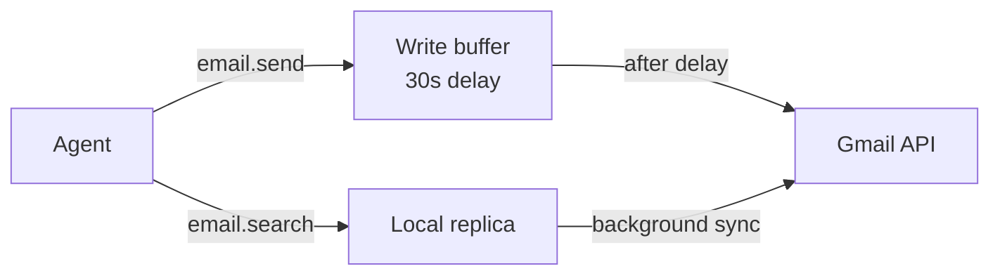

# Connect Gmail

By the end of this page, your agents will be able to search, read, and send emails through the Service Proxy safety chain.

!!! tip "Full setup walkthrough"
    For the complete OAuth setup (Google Cloud console, redirect URIs, dashboard and CLI connect flows), see **[Connecting Services](../guides/connecting-services.md)**. This page explains how email capabilities work once connected.

## How the Service Proxy works

KruxOS never gives agents direct access to Gmail. Instead, the Service Proxy provides three layers of safety:

1. **Read-replica** — emails are synced to a local SQLite database. Search and read operations hit the local copy, not Gmail. Zero risk of accidental deletion or modification during reads.
2. **Write buffer** — sends, deletes, and label changes are buffered for a configurable delay (default: 30 seconds). During this window, writes can be cancelled.
3. **Batch protection** — if an agent tries to send more than 5 emails in a short window, the operation escalates to the KruxOS approval queue.



## Email capabilities

Seven typed `email.*` capabilities are exposed to agents once Gmail is connected:

| Capability | Description | Safety |
|-----------|-------------|--------|
| `email.search` | Search messages by query | Reads local replica |
| `email.read` | Read full message content | Reads local replica |
| `email.send` | Send a new email | Buffered with delay |
| `email.reply` | Reply to a message | Buffered with delay |
| `email.forward` | Forward a message | Buffered with delay |
| `email.delete` | Delete a message | Soft-delete, 24 h recovery via the trash subsystem |
| `email.label` | Add/remove labels | Buffered with delay |

These show up under `tools/list` annotated with their policy tier.

## Quick connect

=== "Dashboard"

    1. Open **Service Proxy** (`/proxy`) or use the connect flow in **Connecting Services**.
    2. Click **Connect Gmail** and follow the OAuth prompts.

=== "CLI"

    ```bash
    kruxos connect gmail
    ```

See [Connecting Services](../guides/connecting-services.md) for prerequisites and the Google OAuth client setup.

## Verify from the SDK

```python
import asyncio
from kruxos import KruxOS

async def main():
    os = await KruxOS.connect_async(
        endpoint="ws://localhost:7700",
        agent_name="my-agent",
        api_key="7f3a8c1d2e9b5a4f8e6c1d3b7a9f2e5c8d1b4a7f3c9e6d8b1a4c7f2e5d9b8a3c",
        purpose="Gmail test",
    )

    try:
        result = await os.call_async(
            "email.search",
            query="from:boss subject:urgent",
            max_results=5,
        )
        print(result)
    finally:
        await os.close_async()

asyncio.run(main())
```

## Next steps

- [Connecting Services](../guides/connecting-services.md) — full Gmail & Slack setup
- [Service Proxy](../enterprise/service-proxy.md) — architecture deep dive
- [Approval Workflow](../guides/approval-workflow.md) — how buffered writes escalate